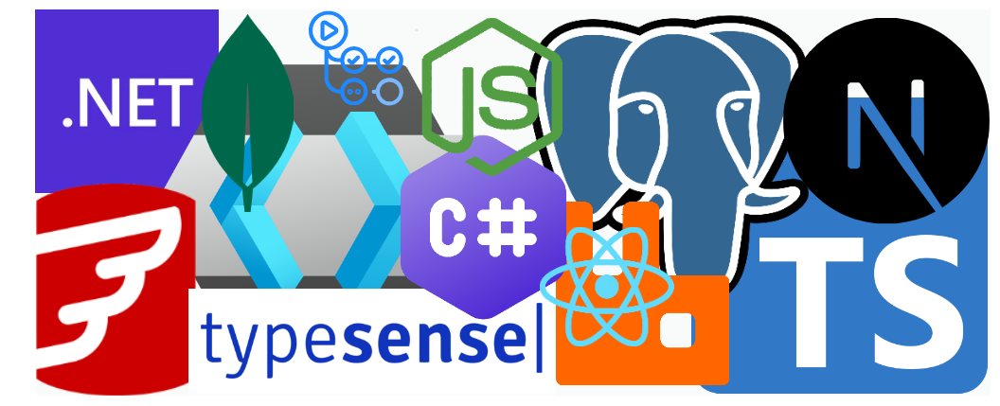
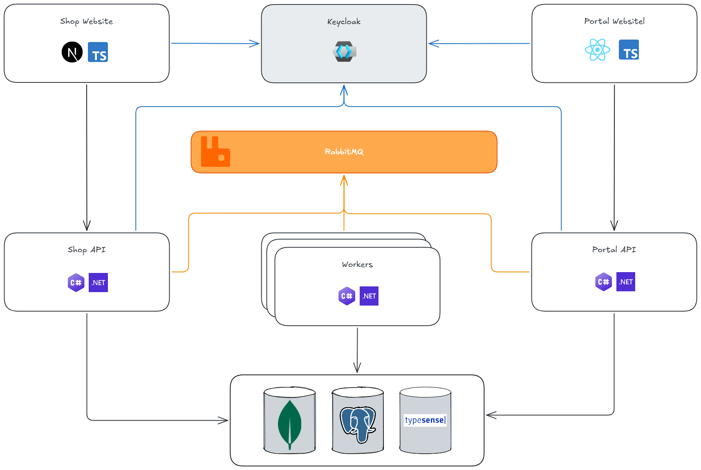

# Offgrid

This project provides demonstration code for an online adventure store built using .NET 10, Nextjs, and React. The intention of this project is to be used as a sample project for learning and demonstration purposes. It is based on a fictitous e-commerce business called **_Offgrid_** that sells adventure goods via it's e-commerce website.

---

## ☰ Overview

**_Offgrid_** is an e-commerce business. It operates as an online retail destination for adventure enthusiasts, offering a curated selection of adventure gear for exploration and outdoor pursuits. It specializes in biking, winter sports, and water sports equipment.

This project will illustrate how to build 2 primary systems in order to fulfill Offgrid business requirements. The 2 primary systems are as follows:

1. <u>Shopping Website</u>
   
   A Nextjs web application frontend with a .NET 10 API backend.

2. <u>Staff Portal</u>
   
   A React web application frontend with a .NET 10 API backend.

This repository follows the [Monorepo] strategy, and is comprised of design, documentation, application code, and infrastructure code. It showcases a variety of practices for integrating and orchestrating various components of a modern software ecosystem. The objective is to provide a practical, hands-on example that can be used to explore a multitude of concepts, including (and not limited to) the following:

- Provide an organizational design
- Implement specific standard, patterns and practices used across a variety of areas such as _Frontend_, _Backend_, _Devops_, _Docker_, _Git_
- Design and build REST based API's using the latest version of [C# 14] and [.NET 10] Framework
- Design and build a customer facing e-commerce website using [Next.js]
- Design and build an internal administration application using [React]
- Provision infrastructure (platform and applications) into containers using [Docker Desktop] and [Docker Compose]
- Define devops design using [GitHub Actions] to setup CI/CD workflows

---

## 🏦 Organizational Design

As mentioned above, this project is intended as a demonstration project to illustrate many different ideas and concepts and evolve it over time. Therefore, for interest sakes, an organizational design has also been provided for _Offgrid_. The implementation of the various applications and services will take influence from the design but not follow it strictly.

The design documentation is available as follows:

- [Offgrid Organizational Design](./docs/design/org-design.md)
- [Offgrid Strategic Design](./docs/design/strategic-design.md)

An accompanying guide on Domain Driven Design (DDD) is also provided as part of design documentation:

- [Domain Driven Design Guide](./docs/design/domain-driven-design-guide.md)

---

## 🧱 Project Structure

The project structure will evolve over time. However, this section provides an example of how the project will be generally structured.

```text

offgrid
├── apps                                  # Frontend applications
│   ├── portal-app                        # React admin portal
│   └── shop-app                          # Next.js customer shop
│
├── services                              # .NET backend services
│   ├── Offgrid.slnx
│   ├── portal/
│   │   ├── Offgrid.Portal.slnx
│   │   └── src/                          # Portal APIs, domain services, processors
│   └── shop/
│       ├── Offgrid.Shop.slnx
│       └── src/                          # Shop API and services
│
├── infra
│   └── local                             # Local development infrastructure
│       ├── compose.yaml                  # Main compose file (using include directive for multi-compose-file support)
│       │
│       ├── flyway                        # Flyway docker config
│       │   └── compose.yaml              # Custom Flyway compose file
│       │
│       ├── rabbitmq                      # RabbitMQ docker config
│       │   └── compose.yaml              # Custom RabbitMQ compose file
│       │
│       ├── postgres                      # Postgres docker config
│       │   └── compose.yaml              # Custom Postgres compose file
│       │
│       └── keycloak                      # Keycloak docker config
│           └── compose.keycloak.yaml     # Custom Keycloak compose file
│       
├── libs                                  # Shared libraries
│   └── dotnet                            # .NET shared libraries
│
├── docs
│   ├── design                            # Architecture and DDD docs
│   ├── images                            # Diagrams and visual assets
│   ├── portal                            # Portal app docs
│   ├── shop                              # Shop app docs
│   └── standards                         # Engineering standards
│
├── scripts
├── *.code-workspace
│
└── README.md

```

---

## 🤖 Technology Stack



<br />

Below is a table that summarises the technology stack that has been chosen to implement and manage the various applications and API's.

<br />


| Category                 | Technology       | Badge                                                                                                                                                                      | Description                                                                               |
| ------------------------ | ---------------- | -------------------------------------------------------------------------------------------------------------------------------------------------------------------------- | ----------------------------------------------------------------------------------------- |
| **Languages**            | C#               | [](https://learn.microsoft.com/dotnet/csharp/)                        | Primary backend language for robust, type-safe enterprise applications                    |
|                          | TypeScript       | [](https://www.typescriptlang.org/)                  | Typed superset of JavaScript used for frontend, Node.js backend, and tooling              |
|                          | Bash             | [](https://www.gnu.org/software/bash/)                                    | Shell scripting for automation, CI/CD scripts, and local dev workflows                    |
| **Backend & Frameworks** | .NET 10          | [](https://dotnet.microsoft.com/)                                          | Modern cross-platform framework for high-performance APIs, services & microservices       |
|                          | Node.js          | [](https://nodejs.org/)                                              | JavaScript runtime for server-side logic, real-time features & lightweight APIs           |
|                          | Next.js          | [](https://nextjs.org/)                                                  | React framework with SSR, SSG, API routes & full-stack capabilities                       |
|                          | React            | [](https://react.dev/)                                                    | Component-based UI library powering interactive frontends                                 |
| **Identity & Auth**      | Keycloak         | [](https://www.keycloak.org/)                                     | Open-source identity & access management (OIDC/OAuth2/SAML, SSO, user federation)         |
| **Databases & Search**   | PostgreSQL       | [](https://www.postgresql.org/)                             | Powerful, standards-compliant relational SQL database with strong ACID guarantees         |
|                          | MongoDB          | [](https://www.mongodb.com/)                                  | Flexible document-oriented NoSQL database for schemaless or semi-structured data          |
|                          | Typesense        | [](https://typesense.org/)                                                    | Fast, typo-tolerant, open-source search engine (Algolia alternative)                      |
| **Messaging**            | RabbitMQ         | [](https://www.rabbitmq.com/)                                     | Reliable message broker for queues, pub/sub, task distribution & microservices decoupling |
| **Migrations**           | Flyway (Red Hat) | [](https://flywaydb.org/)                                                           | Version-controlled SQL-based database migrations (schema evolution tool)                  |
| **DevOps & Infra**       | Docker / Compose | [](https://www.docker.com/)                                      | Containerization & multi-container local orchestration for consistent environments        |
|                          | Terraform        | [](https://www.terraform.io/)                           | Infrastructure as Code for provisioning & managing cloud resources declaratively          |
|                          | GitHub Actions   | [](https://github.com/features/actions) | CI/CD pipelines, automation workflows & deployment orchestration directly in GitHub       |
| **Tools**                | Git              | [](https://git-scm.com/)                                                  | Distributed version control system for source code management                             |
|                          | VS Code          | [](https://code.visualstudio.com/)                      | Lightweight, extensible code editor with excellent support for this entire stack          |

<br />

The following diagram provides a very high level overview of where various technology stack choices are used:

<br />



<br />

- Next.js and Typescript are used to build the public facing shopping website
- React and Typescript are used to build the internal facing staff portal that manages the backoffice
- C# 14 .NET 10 is used to build API's and Background Services (Workers/Producers/Consumers)
- RabbitMQ is used as a message bus
- Keycloak provide authentication and authorization to the web applications and API's
- MongoDB is used for the product catalog
- Typesense is used for searching products
- Postgresql is used for data requiring ACID (Atomicity, Consistency, Isolation, Durability) compliance
- Redgate Flyway is used to manage and version database migrations
- Docker and Docker Compose are used to manage and host infrastructure services, applications, and API's
- Bash script are used to provide utility scripts to help manage and automate tasks

---

## 📋 Tooling Prerequisites

The following software will be required to be installed on your device in order to open and run the applications and API's:

- Node.js 24
- .NET 10
- Git
- Windows Subsystem for Linux (WSL) to use shell scripts. Alternatively, if on Windows, Git Bash.
- Docker Desktop

<br />

📜 NOTE: Run the following script from your terminal to get a "Tool Installation Report". 

- [./scripts/tool-installation-check.sh](./scripts/tool-installation-check.sh)

The script checks against a list of required and optional tools to verify the installation status of each tool.

```text
➜ chmod +x ./tool-installation-check.sh
➜ ./tool-installation-check.sh

Checking installed tools...

=========================== Tool Installation Report ===========================    

 Required Tools:
  ✔️  node: Installed (Version: 24.12.0)
  ✔️  git: Installed (Version: 2.51.2.windows.1)
  ✔️  docker: Installed (Version: Docker version 29.1.3, build f52814d)
  ✔️  npm: Installed (Version: 11.6.4)
  ✔️  dotnet: Installed (Version: 10.0.102)


 Optional Tools:
  ✔️  az: Installed
  ✔️  terraform: Installed
  ✔️  aws: Installed (Version: 2.32.30)
  ✔️  vim: Installed (Version: 9.1)
  ✔️  jq: Installed (Version: jq-1.8.1)
  ✔️  gh: Installed (Version: 2.83.2)
  ✔️  yq: Installed (Version: yq (https://github.com/mikefarah/yq/) version v4.48.1)

```

---

## 🏛️ Standards

- [Git Commit Convention](./docs/standards/git/git-commit-convention.md)
  
  Specifies the standard convention for writing Git commit messages.

- [Git Setup Guide](./docs/standards/git/git-setup.md)
  
  Provides details on the approach and standards relating to git setup and use.

---

## 🤖 Agents Guidance

- Repo-level guide: [./agents.md](./agents.md)
- App guides: [./apps/shop-app/agents.md](./apps/shop-app/agents.md), [./apps/portal-app/agents.md](./apps/portal-app/agents.md)
- Service guides: [./services/agents.md](./services/agents.md), [./services/shop/agents.md](./services/shop/agents.md), [./services/portal/agents.md](./services/portal/agents.md)
- .NET Lib guides: [./libs/dotnet/agents.md](./libs/dotnet/agents.md)
- Infra guide: [./infra/agents.md](./infra/agents.md)
- Docs guide: [./docs/agents.md](./docs/agents.md)
- Helper script: [./scripts/show-agents.sh](./scripts/show-agents.sh)
- Copilot instructions: [./.github/copilot-instructions.md](./.github/copilot-instructions.md)

---

## 🚀 Getting Started

> [!IMPORTANT]
> &nbsp;  
> Please take note of the comprehensive [**📋 onboarding document**](./docs/onboarding.md).
> &nbsp;  
> &nbsp;  
> The [onboarding document](./docs/onboarding.md) is completely generated using GitHub Copilot (Grok Code Fast 1/Claude Opus 4.6) with some minor tweaks between the different AI models.

### Read The Docs

Find documentation here:

- Infra Docs
  - [./infra/local/README.md](./infra/local/README.md)

- Portal Design Docs
  - [./docs/portal/design/version-1](./docs/portal/design/version-1)

- Shop Design Docs
  - [./docs/shop/design/version-1](./docs/shop/design/version-1)

- App Docs
  - shop-app: [./apps/shop-app/README.md](./apps/shop-app/README.md)
  - portal-app: [./apps/portal-app/README.md](./apps/portal-app/README.md)

- Service Docs
  - shop-api: [./services/shop/README.md](./services/shop/README.md)
  - portal-api: [./services/portal/README.md](./services/portal/README.md)

- Other Docs
  - [Offgrid Organizational Design](./docs/design/org-design.md)
  - [Offgrid Strategic Design](./docs/design/strategic-design.md)
  - [Domain Driven Design Guide](./docs/design/domain-driven-design-guide.md)

### Verify Prerequisites

> [!IMPORTANT]
> - Run these commands from a Git Bash / POSIX shell (on Windows use Git Bash or WSL).
>
> - Ensure that all scripts have execute (`x`) permissions. Run `chmod +x my-script.sh` to add execute permissions.

```bash

# verify tool installation
./scripts/tool-installation-check.sh

# verify environment setting files are created
./scripts/env-file-check.sh

# verify host file entries
./scripts/host-file-entry-check.sh

```

Alternatively, use the following wrapper script that runs all prereq scripts from above:

```bash

# run all prerequisite checks
./scripts/prereq-check.sh

```

### Run Infrastructure Services

This section explains how to run the required infrastructure services locally in Docker. For example:

- Postgres
- Keycloak
- Flyway

> [!IMPORTANT]
> - Run these commands from a Git Bash / POSIX shell (on Windows use Git Bash or WSL).
>
> - Ensure that all scripts have execute (`x`) permissions. Run `chmod +x my-script.sh` to add execute permissions.

```bash

# start infrastructure stack
./infra/local/scripts/compose.sh up

# verify infrastructure stack
./infra/local/scripts/compose.sh ps

# run flyway migrations
./infra/local/scripts/flyway.sh migrate

```

Alternatively, use the following wrapper scripts:

```bash

# run all infrastructure services (postgres, keycloak, etc) locally
./scripts/run-infra-services.sh

# run shop services (app, api) in Docker (optional)
./scripts/run-shop-services.sh

```

### Run Shop Services

### Using Docker

This section explains how to run the shop services locally in Docker. For example:

- shop-app (nextjs)
- shop-api (.NET 10)

> [!IMPORTANT]
> - Run these commands from a Git Bash / POSIX shell (on Windows use Git Bash or WSL).
>
> - Ensure that all scripts have execute (`x`) permissions. Run `chmod +x my-script.sh` to add execute permissions.

```bash

# start infrastructure stack
./infra/local/scripts/compose.sh up

# verify infrastructure stack
./infra/local/scripts/compose.sh ps

# run flyway migrations
./infra/local/scripts/flyway.sh migrate

```

Alternatively, use the following wrapper scripts:

```bash

# run all infrastructure services (postgres, keycloak, etc) locally
./scripts/run-infra-services.sh

# run shop services (app, api) in Docker (optional)
./scripts/run-shop-services.sh

```

### Run Portal Services

This section explains how to run the portal services locally in the terminal. For example:

- Portal Api (.NET 10)
  
  ```pwsh
  dotnet watch run --project ./services/portal/src/Offgrid.Portal.Api/Offgrid.Portal.Api.csproj
  ```

- Portal Customer Outbox Processor (.NET 10)
  
  ```pwsh
  dotnet watch run --project ./services/portal/src/Offgrid.Portal.Customers.OutboxProcessor/Offgrid.Portal.Customers.OutboxProcessor.csproj
  ```

- Portal Customer Event Processor (.NET 10)
  
  ```pwsh
  dotnet watch run --project ./services/portal/src/Offgrid.Portal.Customers.EventProcessor/Offgrid.Portal.Customers.EventProcessor.csproj
  ```

- Portal App (Reactjs)
  
  ```pwsh
  npm run dev --prefix ./apps/portal-app
  ```

For Windows users, open up Powershell in Windows Terminal and run the following command:

```pwsh

# ./scripts/portal-wt.ps1
# Update repo path in script to your local repo path

pwsh -file .\portal-wt.ps1

```

### Access Infra and Services

Access the apps and services via the following links:

- [Shop App Website (http://localhost:3000)](http://localhost:3000)
  - See [./apps/shop-app/README.md](./apps/shop-app/README.md) for more details

- [Shop API (http://localhost:7000)](http://localhost:7000)
  - See [./services/shop/README.md](./services/shop/README.md) for more details

- [Portal App Website (http://localhost:4000)](http://localhost:4000)
  - See [./apps/portal-app/README.md](./apps/portal-app/README.md) for more details

- [Portal API (http://localhost:7001)](http://localhost:7001)
  - See [./services/portal/README.md](./services/portal/README.md) for more details

- [Keycloak Admin UI (http://localhost:8080)](http://localhost:8080)

- [RabbitMQ Admin UI (http://localhost:15672)](http://localhost:15672)

Connect to database services:

See [Infrastructure README (./infra/local/README.md)](./infra/local/README.md)

- [Postgres psql (./infra/local/scripts/psql.sh)](./infra/local/scripts/psql.sh):  `./infra/local/scripts/psql.sh`

- [Flyway (./infra/local/scripts/flyway.sh)](./infra/local/scripts/flyway.sh): `./infra/local/scripts/flyway.sh info`

- [RabbitMQ Admin](./infra/local/scripts/rabbitmqadmin.sh): `./infra/local/scripts/rabbitmqadmin.sh`

### Custom Tasks

> [!NOTE]
> Take note of the Visual Studio Tasks that have been defined for this project.  
> - See [tasks.json](./.vscode/tasks.json)  
> - Press `Ctrl+Shift+b` to open build menu that displays tasks

A summary of the [tasks.json](./.vscode/tasks.json) is provided as follows:

- **infra**
  - `bash: compose up` — Start the local infra stack via the compose helper script.
  - `bash: compose down` — Stop and remove the local infra stack via the compose helper script.
  - `bash: compose ps` — Show status of local infra containers.
  - `bash: compose logs` — Show logs for a selected service (prompted).
  - `bash: compose up-recreate` — Recreate a selected service (prompted).
  - `bash: psql` — Open a Postgres CLI session using the repo script.
  - `bash: rabbitmqadmin` — Run RabbitMQ admin CLI using the repo script.
  - `bash: flyway` — Run Flyway command (prompted).
- **shop apps/services**
  - `dotnet: run shop-api` — Run the Shop API with dotnet watch.
  - `npm: run shop-app` — Run the Shop frontend app in dev mode.
- **portal apps/services**
  - `dotnet: run portal-api` — Run the Portal API with dotnet watch.
  - `dotnet: run portal-outbox-processor` — Run the Portal Customers Outbox Processor with dotnet watch.
  - `dotnet: run portal-event-processor` — Run the Portal Customers Event Processor with dotnet watch.
  - `npm: run portal-app` — Run the Portal frontend app in dev mode.

---

## 🏷️ Versioning

I use [SemVer](http://semver.org/) for versioning. For the versions available, see the [tags on this repository](https://github.com/drminnaar/offgrid/tags).

- [Version 1.0.0](https://github.com/drminnaar/offgrid/releases/tag/v1.0.0)
  
  This is the initial release of Offgrid, a reference/demo e-commerce project showcasing a modern, monorepo-based online adventure gear store (biking, winter & water sports equipment). Built with .NET 10 (C# 14) for the backend APIs, Next.js + React + TypeScript for the customer-facing shopping site, and Keycloak for authentication, it demonstrates clean architecture, Domain-Driven Design (DDD), and full local development setup via Docker Compose.

  Key highlights include:

  - Customer shopping frontend (Next.js) + .NET API
  - PostgreSQL + Flyway migrations, Keycloak (OIDC/OAuth2)
  - Monorepo layout: apps/, libs/, infra/, docs/, scripts/
  - One-command startup scripts & prerequisite validation
  - Extensive DDD & architecture documentation
  - No binaries/assets attached — source code & Docker only
  
  See [release notes](https://github.com/drminnaar/offgrid/releases/tag/v1.0.0).

  See [the code](https://github.com/drminnaar/offgrid/tree/v1.0.0).

  See [design docs](./docs/shop/design/version-1).

---

## ✍🏼 Authors

* **Douglas Minnaar** - *Sole and primary maintainer* - [drminnaar](https://github.com/drminnaar)

---

[.NET 10]: https://learn.microsoft.com/en-us/dotnet/core/whats-new/dotnet-10/overview
[C# 14]: https://learn.microsoft.com/en-us/dotnet/csharp/whats-new/csharp-14
[.NET Introduction]: https://learn.microsoft.com/en-us/dotnet/core/introduction
[C# Documentation]: https://learn.microsoft.com/en-us/dotnet/csharp/tour-of-csharp
[C#]: https://learn.microsoft.com/en-us/dotnet/csharp
[.NET SDK (Software Development Kit)]: https://learn.microsoft.com/en-us/dotnet/core/sdk
[Next.js]: https://nextjs.org
[React]: https://react.dev/
[Docker Desktop]: https://www.docker.com/products/docker-desktop
[Docker]: https://www.docker.com
[Docker Compose]: https://docs.docker.com/compose
[GitHub Actions]: https://github.com/features/actions
[Monorepo]: https://grokipedia.com/page/Monorepo
[Node.js]: https://nodejs.org/en
[TypeScript]: https://www.typescriptlang.org/
[Bash]: https://grokipedia.com/page/Bash_(Unix_shell)
[RabbitMQ]: https://www.rabbitmq.com/
[PostgreSQL]: https://www.postgresql.org/
[Typesense]: https://typesense.org/
[MongoDB]: https://www.mongodb.com/
[Keycloak]: https://www.keycloak.org/
[GitHub Actions]: https://github.com/features/actions
[Redgate Flyway]: https://www.red-gate.com/products/flyway/