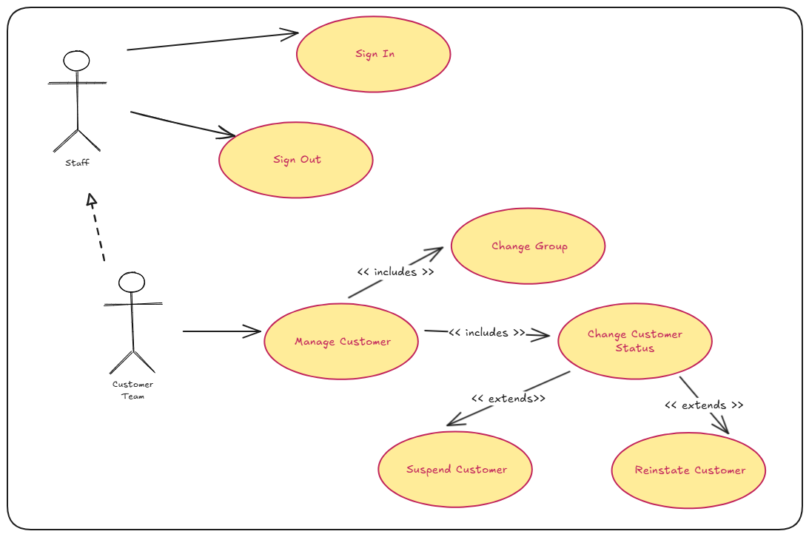
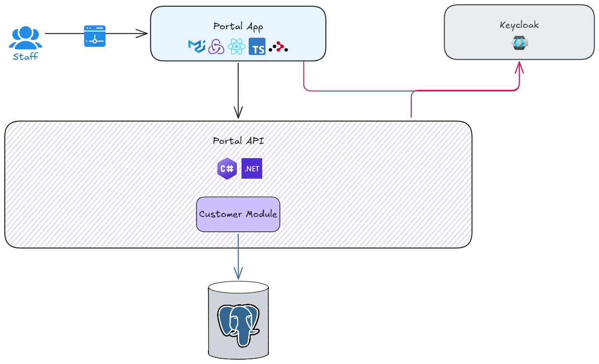

# Offgrid Portal API - Version 1

---

## 🗺️ Overview

As a staff member, you will be able to:

- open the web application with a default landing page
- sign-in

As a Customer Team member, you will be able to:

- open the web application with a default landing page
- sign-in, and sign-out
- manage customer details
  - view customer details
  - change customer assigned group
  - change customer status

> [!IMPORTANT]
> &nbsp;  
> Staff user accounts are managed through the Keycloak Admin Portal.  
> &nbsp;  

 

---

## 📐 High Level Design

---

## 🛒 Portal Website

The primary areas of focus in this version are as follows:

- Create initial React application and establish baseline (minimal required setup)
- Introduce User Interface (UI) libraries to provide styling
- Introduce routing libraries to enable navigation
- Introduce state management
- Create navigation bar
- Introduce auth capability like sign-in, and sign-out
- Integrate with Portal API to manage customers
- Create Dockerfile to define Portal web application image

---

## { ... } Portal API

The Portal API follows a [modular monolith](https://grok.com/share/c2hhcmQtMw_f1c77275-98eb-4a84-8056-1909c5036e4c) architectural style.

The primary areas of focus in this version are as follows:

- Create initial .NET 10 API and establish baseline (minimal requried setup)
- Once a baseline is established, introduce the following capabilities to the API
  - custom logging setup
  - error handling
  - validation
- Create customers endpoint to allow Portal application to manage customer details
  - Integrate with Keycloak API to manage user attributes within keycloak
- Introduce auth capability to ensure that relevant endpoint requests are authorised
- Create Dockerfile to define Portal API image

---

## 🏗️ Infrastructure

The primary areas of focus in this version are as follows:

- Define initial Docker compose file to manage API and Web Application services
- Update Keycloak infrastructure by new realm for the Portal admin app
  - Define clients
  - Define roles
  - Define groups
  - Define sample users

---
