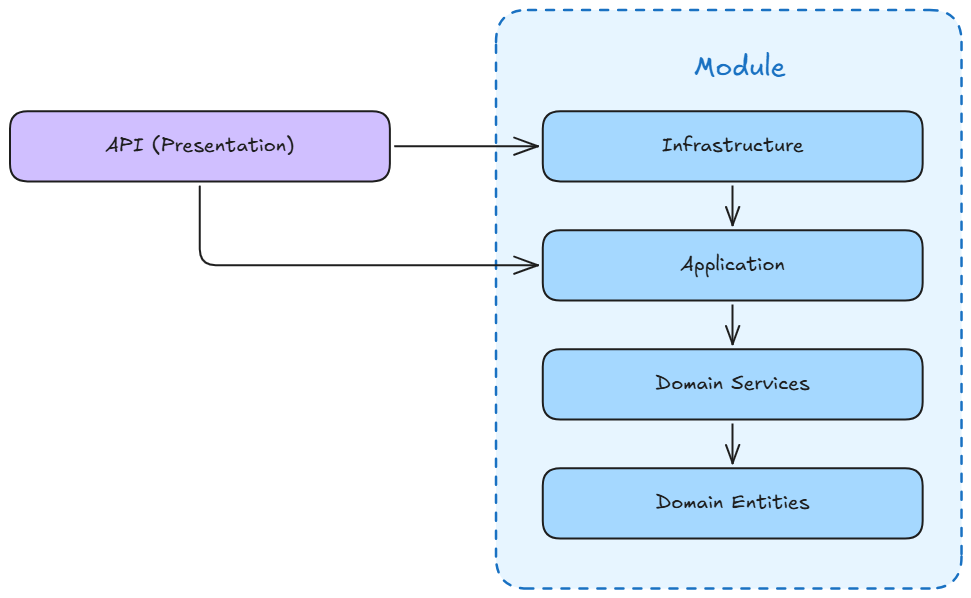

# Shop API

This is the primary API used by the Shop website.

---

## 📐 Design

### High Level Solution Design

See [design documentation](../docs/design/version-1/README.md):

- [Version 1 - README (Current)](../docs/design/version-1/README.md) - Represents `version 1` target state.

### High Level API Design

The overall API design follows a layered architecture using a [Modular Monolith](https://www.thoughtworks.com/en-us/insights/blog/microservices/modular-monolith-better-way-build-software) design. Each module uses a layered architecture similar to the [Clean Architecture](https://grokipedia.com/page/Clean_Architecture).

The following diagram illustrates that an API will use one or more modules to satisfy the the API resource requirements:

<br />


<br />

The following diagram illustrates the various layers of the architecture, along with the direction of dependencies:

<br />



<br />

---

## 🛠️ Initial Installation

This is a [.NET 10](https://dotnet.microsoft.com/en-us/) - [Minimal API project](https://learn.microsoft.com/en-us/aspnet/core/fundamentals/minimal-apis?view=aspnetcore-10.0) created with [`dotnet CLI`](https://learn.microsoft.com/en-us/dotnet/core/tools/).

The initial project was created as follows:

```bash

dotnet new sln --name Offgrid
dotnet new webapi --no-https --no-openapi --use-minimal-apis --output ./src/ShopApi
dotnet sln ./Offgrid add ./src/ShopApi

```

---

## 🚀 Getting Started

### 1. Run Infra Services

Ensure that you have followed the project infrastructure [README](../../infra/local/README.md) guide and have the required services running on your local machine.

The following requirements must be satisfied before running Shop API:

- ✅️ Postgresql service is running
- ✅️ Flyway migrations applied

### 2. Start API

```bash

dotnet watch run ./src/ShopApi

```

### 3. Run Requests

The [REST Client](https://marketplace.visualstudio.com/items?itemName=humao.rest-client) VSCode extension is required to run requests.

- Root:
  - See [`./requests/root.http`](./requests/root.http)

- Customers:
  - Upsert - See [`./requests/customers-upsert.http`](./requests/customers-upsert.http)

---

## 🐳 Docker Setup

### API Settings

When the API is packaged into a Docker container, it will use `Docker` as an environment setting. For example, the `ASPNETCORE_ENVIRONMENT` setting is set in the [./compose.yaml](./compose.yaml) file:

```yaml
environment:
  - ASPNETCORE_ENVIRONMENT=Docker
```

This will ensure that the `appsettings.Docker.json` file is used when initialising Docker container.

The following appsettings are used for Docker. Note that Docker Compose service names are used instead of localhost. Inside a container, localhost refers to the container itself, not your host machine or other containers. Each service runs on its own network namespace, so containers must reach each other via the Compose network DNS name (the service name), not localhost.

> [!IMPORTANT]
> Add a `keycloak` entry to your hosts file so the browser can resolve `http://keycloak:8080` during login/redirect callbacks when running locally. This maps the hostname to your local machine.
> - Windows: Edit `C:\Windows\System32\drivers\etc\hosts` as Administrator and add:
> `127.0.0.1 keycloak`
> - Linux: Edit `/etc/hosts` as root and add:
> `127.0.0.1 keycloak`

```json
  "ConnectionStrings": {
    "Offgrid": "Server=postgres:5432;User Id=postgres;Password=password;Database=offgrid"
  },
  "KeycloakSettings": {
    "Authority": "http://keycloak:8080/realms/offgrid-public",
    "Audience": "shop-api",
    "RequireHttpsMetadata": false
  },
  "CorsPolicySettings": {
    "DefaultPolicyName": "AllowShopApp",
    "Policies": [
      {
        "Name": "AllowShopApp",
        "AllowedOrigins": [
          "http://shop-app:7000"
        ]
      }
    ]
  }
```

### Manage Shop Containers

The `shop-api` defines its own [`Dockerfile`](./Dockerfile) and [`compose.yaml`](./compose.yaml) file.

The containers are managed using `docker compose` as follows:

```bash
# location: ./apps/shop/infra

# start containers
docker compose up --build

# stop containers
docker compose down --volumes --remove-orphans

# recreate shop-api container
docker compose up --build -d --force-recreate shop-api

# recreate shop-app container
docker compose up --build -d --force-recreate shop-app
```

### Sending Requests

When using the [`./requests`](./requests) to test API endpoints, please ensure to select the correct environment in VSCode. See [.vscode/settings.json](../../../.vscode/settings.json).

```json
"rest-client.environmentVariables": {
    "$shared": {
      "SHOP_API_BASE_URL": "http://localhost:7000",
      "OG_KC_BASE_URL": "http://localhost:8080",
    },
    "docker": {
      "SHOP_API_BASE_URL": "http://localhost:7000",
      "OG_KC_BASE_URL": "http://keycloak:8080",
    }
  }
```

Switch / choose the active environment:

1. Status bar (easiest & most visible)
   - Look at the bottom-right of VS Code window → you'll see something like
     REST Client: No Environment or REST Client: local.
   - Click it → pick from the list (local / staging / prod / No Environment / …).
2. Keyboard shortcut:
   - Ctrl + Alt + E (Windows/Linux)
   - Cmd + Alt + E (macOS)
3. Command Palette:
   - Ctrl + Shift + P (or Cmd + Shift + P) → type Rest Client: Switch Environment → select one.

---
