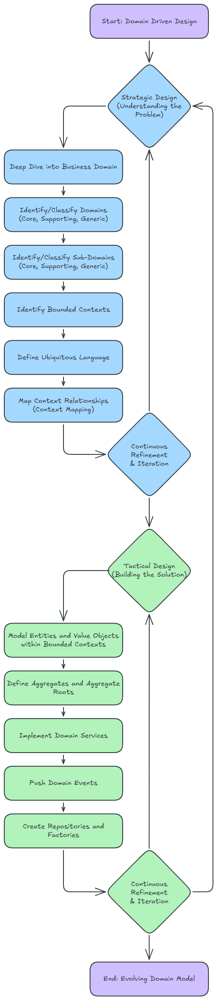

# Domain Driven Design

This document is provided as a high-level guide of _Domain Driven Design_.

## Contents

- [Domain Driven Design](#domain-driven-design)
  - [Contents](#contents)
  - [Overview](#overview)
  - [Strategic Design](#strategic-design)
  - [Tactical Design](#tactical-design)
  - [Problem Space](#problem-space)
  - [Solution Space](#solution-space)
  - [Domain](#domain)
  - [Sub-Domain](#sub-domain)
  - [Bounded Context](#bounded-context)
  - [Ubiquitous Language](#ubiquitous-language)

## Overview

Domain-Driven Design (DDD) is an approach to software development that emphasizes understanding and modeling the core problem space.

- It's about building software that directly reflects the reality of the business it serves.
- It divides the design process into _[problem space]_ and _[solution space]_.
- Employs both strategic and tactical design patterns to address complexity.

Domain Driven Design Process:

Click to expand process diagram

 

---

## Strategic Design

Strategic design focuses on the big-picture/high-level structure of the system and how different parts of the system relate to each other. It's about breaking down a large, complex domain into smaller, manageable pieces and defining the relationships between them. It operates in the _[problem space]_ to define boundaries and relationships.

**Key Concepts:**

- Domain: The overall subject area or business activity that the software is intended to support. For example, in an e-commerce system, the domain might be "Online Retail."

- Sub-domains: Large domains can be broken down into distinct sub-domains, each representing a particular area of expertise or concern within the larger domain. Sub-domains can be classified as:

  - Core Domain: The most critical and differentiating part of the business, where the unique value lies. This is where you should invest the most effort and talent.

  - Supporting Sub-domains: Necessary for the business to function but not a core differentiator. They often support the core domain.

  - Generic Sub-domains: Common solutions that are not specific to the business and can often be bought off-the-shelf (e.g., identity management, payment gateways).

- Bounded Contexts: A central concept in strategic design. A Bounded Context defines an explicit boundary within which a particular domain model is defined and applicable. Terms and concepts can have different meanings or interpretations in different Bounded Contexts, and it's crucial to keep these contexts separate to avoid ambiguity and maintain model integrity.

**Key Tools:**

- Context Mapping: Visualizes how different bounded contexts interact (e.g., through APIs, events, or shared databases). Common patterns include:
  
  - Partnership: Two contexts collaborate closely.
  - Customer-Supplier: One context depends on another.
  - Conformist: One context adopts the model of another to simplify integration.

- Core Domain Identification: Prioritizes effort on the core domain to maximize business value.

- Distillation: Separates the core domain from supporting and generic domains to focus resources.

**Purpose:** Aligns the system architecture with the business’s strategic goals and ensures scalability.

---

## Tactical Design

Tactical Design focuses on the detailed implementation of the software within a single Bounded Context. It's about defining the building blocks of the domain model and how they interact. It provides patterns to model the domain in code.

**Key Concepts/Patterns:**

- Entities: Objects that have a continuous identity and typically represent something with a lifecycle (e.g., a Customer, an Order). They are identified by an ID, not by their attributes.

- Value Objects: Objects that describe a characteristic or attribute of something else. They have no conceptual identity and are defined by their attributes (e.g., a Money amount, an Address). They are immutable.

- Aggregates: A cluster of associated Entities and Value Objects treated as a single unit for data changes. An Aggregate has a single root Entity (the Aggregate Root) that controls access to the other objects within the Aggregate, ensuring consistency and invariants.

- Domain Services: Operations that don't naturally fit within an Entity or Value Object, often involving multiple domain objects or coordinating actions (e.g., transferring money between accounts).

- Domain Events: Something significant that happened in the domain that other parts of the system might be interested in reacting to (e.g., OrderPlaced, PaymentReceived).

- Repositories: Abstractions over the persistence layer, providing methods to retrieve and store Aggregates.

- Factories: Encapsulate complex object creation logic.

**Purpose:** Translates the domain model into maintainable, expressive code within a bounded context.

---

## Problem Space

The problem space is the real-world business domain or problem that the software aims to address. This is where you explore and understand the business domain and the challenges it presents. It's about delving into the real-world activities, processes, and knowledge of the experts who work within that domain.

 It focuses on understanding the business's goals, processes, and challenges. 

**Key Activities:**

- Engage with domain experts (e.g., business stakeholders) to understand their needs, workflows, and terminology.

- Identify the core problem the software will solve.

- Break down the problem into smaller, manageable parts for analysis.

**Goal:**

- Gain a deep understanding of the business domain to ensure the software addresses real needs.

- To identify the core problems that the software needs to solve and to gain a clear, shared understanding of the domain's intricacies.

---

## Solution Space

The solution space is where the software model is designed and implemented to address the problem space. This is where you design and implement the software to address the problems identified in the problem space. It translates the understanding of the domain into a technical solution. This means, crafting the code, architecture, and infrastructure to deliver a solution that accurately reflects the domain model and effectively solves the business challenges.

**Key Activities:**

- Create models, code, and architecture that reflect the domain’s concepts and rules.
- Ensure the solution aligns with the problem space through iterative refinement.

**Goal:** Build a software system that accurately represents and solves the domain’s problems.

---

## Domain

In DDD, the _Domain_ refers to the sphere of knowledge, real-world problem space, influence, or activity that the software is concerned with (built to address). It encompasses the business’s goals, processes, rules, and knowledge.

For example, if you're building software for an online bookstore, the overarching domain is "selling books online." This encompasses everything from managing the book catalog to processing orders, handling payments, and shipping. The domain represents the entire scope of the business problem.

For example, in an e-commerce system, the domain includes everything related to online shopping, such as products, orders, payments, and customers.

> 💡 Key Points:  
>  
> - The domain is the "what" and "why" of the system, defining the scope of the problem the software solves.  
> - Think of it as "what the business does" and "the environment it operates in."  
> - Understanding the domain is crucial for creating a system that meets the needs of its users and stakeholders.

## Sub-Domain

A Sub-Domain is a smaller, more specialized (focused) area within the larger domain. Real-world domains are rarely monolithic; they are typically complex ecosystems made up of various specialized areas. Breaking down a large domain into sub-domains helps manage complexity.

**Continuing the online bookstore example, sub-domains could include:**

- Book Catalog: Managing book information, genres, authors, availability.
- Order Management: Handling customer orders, order status, cancellations.
- Payment Processing: Managing payment methods, transactions, refunds.
- Shipping: Organizing shipments, tracking deliveries, calculating shipping costs.

**Sub-domains can be further classified:**

- Core Domain: This is the most important part of the business, where the organization must excel to achieve its goals and gain a competitive advantage. For the bookstore, a user-friendly and comprehensive "Book Catalog" might be a core domain.

- Supporting Sub-Domain: These provide auxiliary or supporting functions for the core domain. They are specific to the organization's processes but not its unique selling proposition. "Order Management" could be a supporting sub-domain.

- Generic Sub-Domain: These are areas that are important for operations but don't provide a competitive advantage, and their functionality can often be outsourced or bought off-the-shelf. "Authentication and Authorization" or "Payment Gateway Integration" are common examples.

> 💡 Key Points  
>  
> - Sub-domains help divide the domain into logical segments for better focus and specialization.

---

## Bounded Context

A Bounded Context is a logical (specific) boundary within the system where a specific domain model is defined and applicable. It’s a way to partition the system to manage complexity for a precisely defined area, ensuring that terms and rules have a consistent and unambiguous meaning within that boundary. Outside of this boundary, the same terms might have different meanings, or the model might not apply. Each bounded context typically corresponds to a specific sub-domain and has its own model, code, and database (if needed).

Bounded Contexts are crucial for managing complexity in large systems. They prevent the mixing of different models and ensure that each part of the system can evolve independently.

Example 1 - In our online bookstore:

- The "Book Catalog" bounded context would have a model of a Book that focuses on its metadata (title, author, ISBN, genre, description).

- The "Order Management" bounded context might have a Book represented simply by an ID and price, as its focus is on the order itself, not the book's descriptive details.

- The "Shipping" bounded context might have a Book defined by its weight and dimensions.

Each of these contexts defines its own coherent model and vocabulary, even if they refer to what appears to be the "same" real-world concept (like a book).

Example 2 - In an e-commerce system

The "Order Management" bounded context might define an "Order" as a customer’s purchase, while the "Shipping" bounded context might define an "Order" as a package to be delivered. These contexts avoid ambiguity by keeping their definitions separate.

> 💡 Key Point  
>  
> - Bounded contexts prevent confusion by defining clear boundaries for models and their terminology, often implemented as separate services or modules.  

---

## Ubiquitous Language

The Ubiquitous Language is a shared, common language developed and used by all team members within a specific Bounded Context. This includes domain experts (business analysts, stakeholders), developers, and quality assurance. It's a language that is consistently used in all conversations, documentation, and the code itself.

The purpose of the Ubiquitous Language is to reduce miscommunication and ensure that everyone has a clear and shared understanding of the domain concepts and terminology. When a domain expert talks about a "Customer," the developer should understand it in the exact same way, and the code should reflect that understanding (e.g., a Customer class with relevant attributes and behaviors).

For example, in the "Order Management" bounded context of our bookstore, terms like "Order," "Order Line Item," "Customer," and "Order Status" would be part of the Ubiquitous Language, and their meaning would be strictly defined and consistently used by everyone working on that part of the system.

For example, in the "Order Management" bounded context, terms like "Order," "Cart," and "Payment" are defined precisely and used consistently in code, documentation, and conversations.

> 💡 Key Point  
>  
> - The ubiquitous language bridges the gap between technical and business teams, reducing misunderstandings and ensuring the model reflects the domain accurately.  

---

[Strategic Design]: #strategic-design
[Tactical Design]: #tactical-design
[problem space]: #problem-space
[solution space]: #solution-space