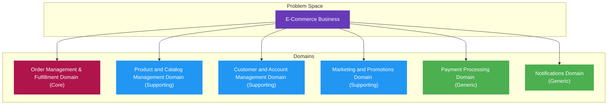
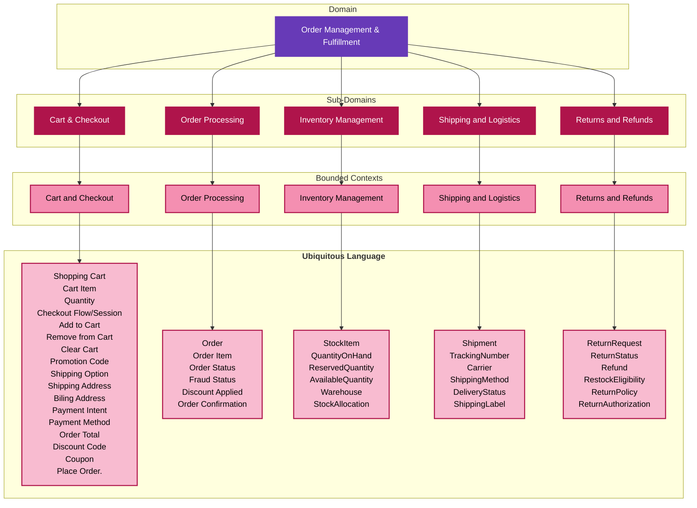
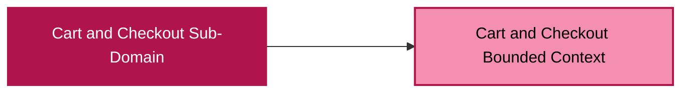
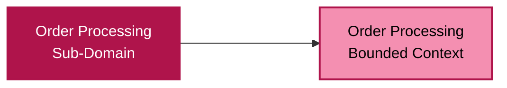
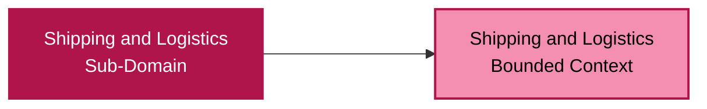
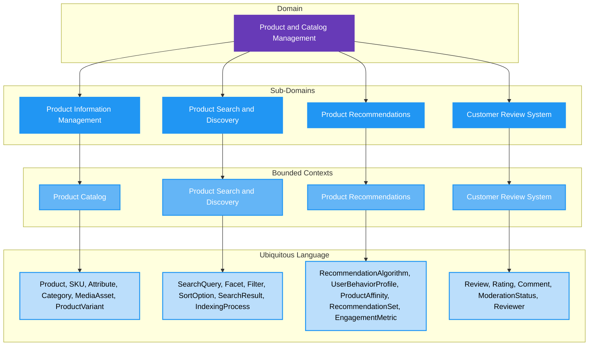
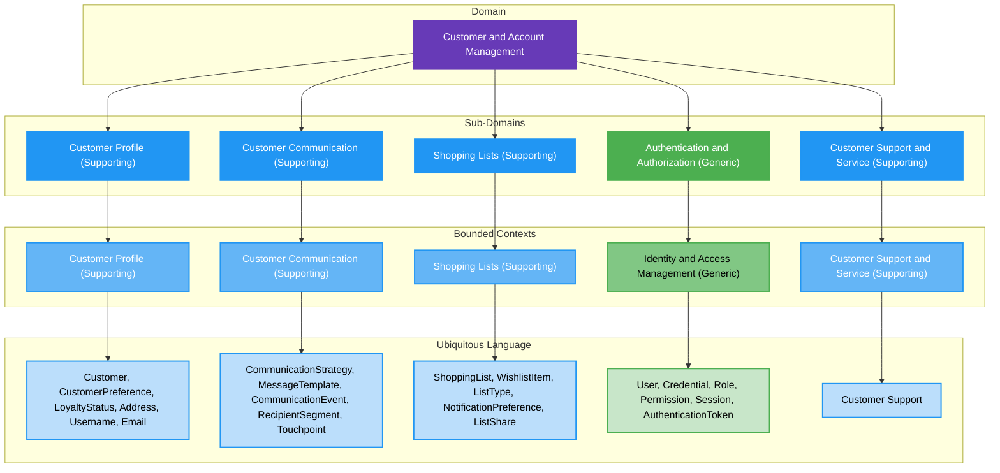
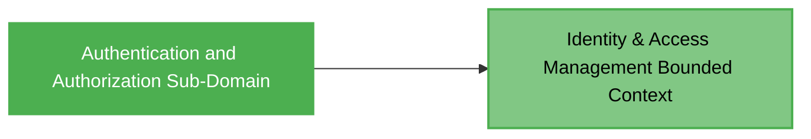
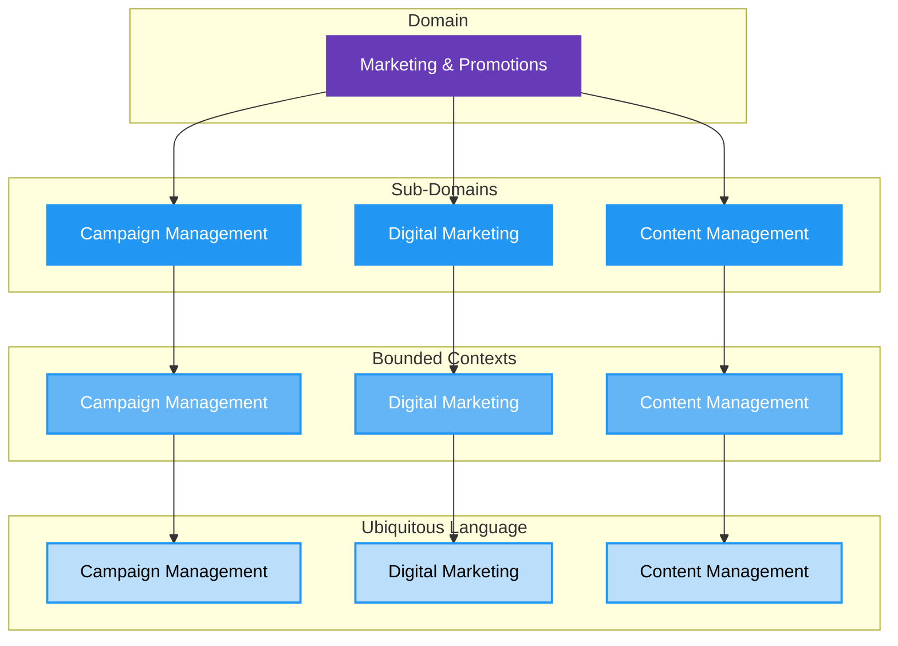
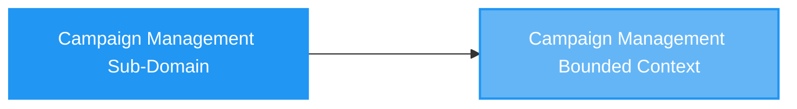

# Offgrid E-Commerce System Strategic Design

> [!NOTE]
> &nbsp;  
> Strategic design focuses on the big-picture/high-level structure of the system and how different parts of the system relate to each other. It's about breaking down a large, complex domain into smaller, manageable pieces and defining the relationships between them. It operates in the _problem space_ to define boundaries and relationships.  
>  
> See [Domain Driven Design companion guide](./domain-driven-design-guide.md) for more information on Domain Driven Design.
> &nbsp;  

## Contents

- [Offgrid E-Commerce System Strategic Design](#offgrid-e-commerce-system-strategic-design)
  - [Contents](#contents)
  - [1. Introduction](#1-introduction)
    - [1.1 Purpose](#11-purpose)
    - [1.2 Scope](#12-scope)
    - [1.3 Audience](#13-audience)
  - [2. Business Context \& Problem Statement](#2-business-context--problem-statement)
    - [2.1 Business Vision and Goals](#21-business-vision-and-goals)
    - [2.2 Problem Statement/Opportunity](#22-problem-statementopportunity)
  - [3. Domain Model Overview](#3-domain-model-overview)
  - [4. Core Domain: Order Management and Fulfillment](#4-core-domain-order-management-and-fulfillment)
    - [4.1. Overview](#41-overview)
    - [4.2. Sub-Domain: Cart \& Checkout (Core)](#42-sub-domain-cart--checkout-core)
      - [4.2.1 Bounded Context: Cart and Checkout (Core)](#421-bounded-context-cart-and-checkout-core)
    - [4.3. Sub-Domain: Order Processing (Core)](#43-sub-domain-order-processing-core)
      - [4.3.1 Bounded Context: Order Processing (Core)](#431-bounded-context-order-processing-core)
    - [4.4. Sub-Domain: Inventory Management (Core)](#44-sub-domain-inventory-management-core)
      - [4.4.1 Bounded Context: Inventory](#441-bounded-context-inventory)
    - [4.5. Sub-Domain: Shipping and Logistics (Core)](#45-sub-domain-shipping-and-logistics-core)
      - [4.5.1 Bounded Context: Shipping](#451-bounded-context-shipping)
    - [4.6. Sub-Domain: Returns and Refunds (Core)](#46-sub-domain-returns-and-refunds-core)
      - [4.6.1 Bounded Context: Returns \& Refunds](#461-bounded-context-returns--refunds)
  - [5. Supporting Domain: Product \& Catalog Management](#5-supporting-domain-product--catalog-management)
    - [5.1. Overview](#51-overview)
    - [5.2. Sub-Domain: Product Information Management (Supporting)](#52-sub-domain-product-information-management-supporting)
      - [5.2.1 Bounded Context: Product Catalog (Supporting)](#521-bounded-context-product-catalog-supporting)
    - [5.3. Sub-Domain: Product Search and Discovery (Supporting)](#53-sub-domain-product-search-and-discovery-supporting)
      - [5.3.1 Bounded Context: Search \& Discovery (Supporting)](#531-bounded-context-search--discovery-supporting)
    - [5.4. Sub-Domain: Product Recommendations (Supporting)](#54-sub-domain-product-recommendations-supporting)
      - [5.4.1 Bounded Context: Recommendations (Supporting)](#541-bounded-context-recommendations-supporting)
    - [5.5. Sub-Domain: Customer Review System (Supporting)](#55-sub-domain-customer-review-system-supporting)
      - [5.5.1 Bounded Context: Reviews and Ratings (Supporting)](#551-bounded-context-reviews-and-ratings-supporting)
  - [6. Supporting Domain: Customer and Account Management](#6-supporting-domain-customer-and-account-management)
    - [6.1. Overview](#61-overview)
    - [6.2. Sub-Domain: Customer Profile (Supporting)](#62-sub-domain-customer-profile-supporting)
      - [6.2.1 Bounded Context: Customer Profile (Supporting)](#621-bounded-context-customer-profile-supporting)
    - [6.3. Sub-Domain: Customer Communication (Supporting)](#63-sub-domain-customer-communication-supporting)
      - [6.3.1 Bounded Context: Customer Communication (Supporting)](#631-bounded-context-customer-communication-supporting)
    - [6.4. Sub-Domain: Shopping Lists (Supporting)](#64-sub-domain-shopping-lists-supporting)
      - [6.4.1 Bounded Context: Shopping List (Supporting)](#641-bounded-context-shopping-list-supporting)
    - [6.5. Sub-Domain: Authentication and Authorization (Generic)](#65-sub-domain-authentication-and-authorization-generic)
      - [6.5.1 Bounded Context: Identity \& Access Management (Generic)](#651-bounded-context-identity--access-management-generic)
    - [6.6. Sub-Domain: Customer Support \& Service (Supporting)](#66-sub-domain-customer-support--service-supporting)
      - [6.6.1 Bounded Context: Customer Support (Supporting)](#661-bounded-context-customer-support-supporting)
  - [7. Supporting Domain: Marketing and Promotions](#7-supporting-domain-marketing-and-promotions)
    - [7.1. Overview](#71-overview)
    - [7.2. Sub-Domain: Campaign Management (Supporting)](#72-sub-domain-campaign-management-supporting)
      - [7.2.1 Bounded Context: Campaign Management (Supporting)](#721-bounded-context-campaign-management-supporting)
    - [7.3. Sub-Domain: Digital Marketing (Supporting)](#73-sub-domain-digital-marketing-supporting)
      - [7.3.1 Bounded Context: Digital Marketing (Supporting)](#731-bounded-context-digital-marketing-supporting)
    - [7.4. Sub-Domain: Content Management (Supporting)](#74-sub-domain-content-management-supporting)
      - [7.4.1 Bounded Context: Content Management (Supporting)](#741-bounded-context-content-management-supporting)
  - [8. Generic Domain: Payment Processing](#8-generic-domain-payment-processing)
    - [8.1. Overview](#81-overview)
    - [8.2. Sub-Domain: Payment Gateway Integration (Generic)](#82-sub-domain-payment-gateway-integration-generic)
      - [8.2.1 Bounded Context: Payment Gateway (Generic)](#821-bounded-context-payment-gateway-generic)
    - [8.3. Sub-Domain: Financial Reporting (Generic)](#83-sub-domain-financial-reporting-generic)
      - [8.3.1 Bounded Context: Financial Reporting (Generic)](#831-bounded-context-financial-reporting-generic)
  - [9. Generic Domain: Notification \& Communication](#9-generic-domain-notification--communication)
    - [9.1. Overview](#91-overview)
    - [9.2. Sub-Domain: Messaging (Generic)](#92-sub-domain-messaging-generic)
      - [9.2.1 Bounded Context: Messaging (Generic)](#921-bounded-context-messaging-generic)


## 1. Introduction

### 1.1 Purpose

This document outlines the high-level structure/domain of the _"Offgrid" E-commerce System_. It's purpose is to align the system architecture with the business’s strategic goals and ensure scalability. It focuses on the logical decomposition based on business domains and how these translate into various systems.

### 1.2 Scope

This document covers the overall problem space. This includes domains, sub-domains, bounded contexts, and ubiquitous language for various contexts. It does not delve into low-level implementation details, specific technology stack choices (beyond general categories), or detailed deployment strategies.

### 1.3 Audience

Technical Leads, Architects, Senior Developers, Product Managers, Business Stakeholders.

---

## 2. Business Context & Problem Statement

### 2.1 Business Vision and Goals

The vision for Offgrid is to create a scalable, performant, and easy-to-use online shopping experience for customers, while simultaneously providing robust and efficient tools for internal operations. Key goals include:

- Provide online shopping experience that satisfies customer needs (what would typically be expected from an e-commerce website).
- Integrate seamlessly with backend systems and processes.
- Improve operational efficiency by providing backoffice to manage all aspects of the business.

### 2.2 Problem Statement/Opportunity

There is currently no e-commerce system. A new e-commerce system must be built from scratch.

---

## 3. Domain Model Overview

This section provides a detailed breakdown of the proposed e-commerce domains and their sub-domains, complete with descriptions and classifications. This decomposition is based on common e-commerce business capabilities and the principles of Domain-Driven Design (DDD).

The following diagram illustrates a high-level decomposition of the problem space and associated domains:



<br />

The following table presents an overview of the proposed structure:

| Domain                             | Sub-Domain                     | Description                                                                                                                                                                                                                                                                                         | Classification |
| :--------------------------------- | :----------------------------- | :-------------------------------------------------------------------------------------------------------------------------------------------------------------------------------------------------------------------------------------------------------------------------------------------------- | :------------- |
| **Order Management & Fulfillment** | Cart & Checkout                | Manages the customer's shopping cart, including adding/removing items, quantity updates, and the entire checkout flow from cart review to order submission.                                                                                                                                         | Core           |
|                                    | Order Processing               | Manages the entire lifecycle of a customer order, including validation, pricing, discounts, fraud checks, and orchestration with other sub-domains.                                                                                                                                                 | Core           |
|                                    | Inventory Management           | Tracks and manages product availability across locations, handling real-time stock updates, reservations, and complex allocation rules.                                                                                                                                                             | Core           |
|                                    | Shipping & Logistics           | Orchestrates the physical movement of products, encompassing shipping method selection, carrier integration, tracking, and returns management.                                                                                                                                                      | Core           |
|                                    | Returns & Refunds              | Manages the complex process of product returns, including return requests, approval/rejection, reverse logistics, quality inspection, restocking, and financial refunds or exchanges. This sub-domain is critical for customer satisfaction and retention.                                          | Core           |
| **Product & Catalog Management**   | Product Information Management | Defines, enriches, and maintains all product-related data, including attributes, descriptions, images, and categorization.                                                                                                                                                                          | Supporting     |
|                                    | Product Search & Discovery     | Enables customers to find products effectively through keyword search, faceted navigation, and sorting options.                                                                                                                                                                                     | Supporting     |
|                                    | Product Recommendations        | Provides personalized product suggestions based on user behavior to increase engagement and conversion.                                                                                                                                                                                             | Supporting     |
|                                    | Customer Review System         | Allows customers to submit ratings and reviews for products, building trust and influencing buying decisions.                                                                                                                                                                                       | Supporting     |
| **Customer & Account Management**  | Customer Profile               | Manages all customer-specific data beyond authentication, including personal information, preferences, and loyalty status.                                                                                                                                                                          | Supporting     |
|                                    | Customer Communication         | Manages the strategy, content, and orchestration of various forms of communication with customers (e.g., personalized marketing messages, proactive service updates, follow-ups), aiming to build relationships and enhance engagement. This sub-domain leverages generic messaging infrastructure. | Supporting     |
|                                    | Shopping Lists                 | Manages customer-created lists of products for future purchase, wish lists, or recurring needs. It allows customers to organize desired items, track availability, and receive notifications, thereby enhancing their shopping experience and encouraging repeat visits.                            | Supporting     |
|                                    | Authentication & Authorization | Handles user identity, registration, login, password management, and access control.                                                                                                                                                                                                                | Generic        |
|                                    | Customer Support & Service     | Manages interactions between customers and the support team, including inquiries, issue resolution, and self-service options.                                                                                                                                                                       | Supporting     |
| **Marketing & Promotions**         | Campaign Management            | Allows the business to define, execute, and track various marketing and promotional campaigns, including discounts and loyalty programs.                                                                                                                                                            | Supporting     |
|                                    | Digital Marketing              | Encompasses technical infrastructure and integrations for SEO, advertising platforms, email marketing, and performance analytics.                                                                                                                                                                   | Supporting     |
|                                    | Content Management             | Manages the creation, storage, organization, and distribution of marketing-related content and digital assets, such as SEO-optimized text, banner images, promotional videos, and website copy. This ensures brand consistency and content relevance across various marketing channels.             | Supporting     |
| **Payment Processing**             | Payment Gateway Integration    | Handles the secure transmission of payment information to external gateways for authorization and capture, ensuring PCI compliance.                                                                                                                                                                 | Generic        |
|                                    | Financial Reporting            | Generates various financial reports such as sales summaries, revenue reports, and tax statements by aggregating transaction data.                                                                                                                                                                   | Generic        |
| **Notification & Communication**   | Messaging                      | Manages automated communication with customers and internal stakeholders, including transactional emails and SMS notifications.                                                                                                                                                                     | Generic        |

---

## 4. Core Domain: Order Management and Fulfillment

- [4.1 Overview](#41-overview)
- [4.2 Sub-Domain: Cart & Checkout (Core)](#42-sub-domain-cart--checkout-core)
   - [4.2.1 Bounded Context: Cart and Checkout (Core)](#421-bounded-context-cart-and-checkout-core)
- [4.3 Sub-Domain: Order Processing (Core)](#43-sub-domain-order-processing-core)
   - [4.3.1 Bounded Context: Order Processing (Core)](#431-bounded-context-order-processing-core)
- [4.4 Sub-Domain: Inventory Management (Core)](#44-sub-domain-inventory-management-core)
   - [4.4.1 Bounded Context: Inventory](#441-bounded-context-inventory)
- [4.5 Sub-Domain: Shipping and Logistics (Core)](#45-sub-domain-shipping-and-logistics-core)
   - [4.5.1 Bounded Context: Shipping](#451-bounded-context-shipping)
- [4.6 Sub-Domain: Returns and Refunds (Core)](#46-sub-domain-returns-and-refunds-core)
     - [4.6.1 Bounded Context: Returns & Refunds](#461-bounded-context-returns--refunds)

### 4.1. Overview

The following diagram illustrates an overview of the _Order Management and Fulfillment Domain_. It indicates how the _Domain_ is deconstructed into _Sub-Domains_, _Bounded Contexts_, and the _Ubiquitous Language_ associated with respective Bounded Context.



- Represents the core of Offgrid as an e-commerce business. The primary value proposition and source of competitive advantages is as follows:

  - take order
  - process order
  - deliver order

- Handles the processing of customer orders from placement to fulfillment.

- Consists of all the capability (business logic and critical operations) that directly impacts revenue and customer satisfaction.

---

### 4.2. Sub-Domain: Cart & Checkout (Core)

- Manages the customer's shopping cart, including functionalities like adding, removing, and updating product quantities.

- Encomapsses the entire checkout flow, from reviewing the cart and applying promotions to selecting shipping options, entering payment details, and finally submitting the order.

- Critical for converting browsing customers into buyers and directly impacts revenue and customer experience

The `Cart and Checkout Sub-Domain` maps to a single `Cart and Checkout Bounded Context`:



#### 4.2.1 Bounded Context: Cart and Checkout (Core)

**Purpose:** This context manages the customer's shopping cart, its contents, and the entire checkout process leading up to order submission. Its model focuses on the pre-order state, where items can be added, removed, quantities adjusted, totals calculated, and guiding customers through purchase process.

**Ubiquitous Language:** Shopping Cart, Cart Item, Quantity, Checkout Flow/Session, Add to Cart, Remove from Cart, Clear Cart, Promotion Code, Shipping Option, Shipping Address, Biling Address, Payment Intent, Payment Method, Order Total, Discount Code, Coupon, Place Order.

**Isolation:** This context ensures that the dynamic and often transient state of a shopping cart is isolated from the immutable nature of a confirmed order. It handles the complex logic of cart validation and promotion/coupon application before an order is finalized.

### 4.3. Sub-Domain: Order Processing (Core)

- Manages the entire lifecycle of a customer order, from initial placement through various states (e.g., pending, confirmed, shipped, delivered, cancelled) to final completion.

- Encapsulates capability related to order validation, precise pricing calculations, discount application, fraud checks, and the orchestration of interactions with other sub-domains like _Inventory_ and _Payment_.

- Functions as the central hub where the most critical and differentiating business logic resides.

The `Order Processing Sub-Domain` maps to a single `Order Processing Bounded Context`:



#### 4.3.1 Bounded Context: Order Processing (Core)

**Purpose:** This context is the central authority for managing the entire lifecycle of a confirmed order, from its creation through various states (e.g., pending, confirmed, shipped, delivered, cancelled). It encapsulates the most critical business rules related to order validation, precise pricing, discount application, and fraud checks.

**Ubiquitous Language:** Order, Order Item, Order Status, Fraud Status, Discount Applied, Order Confirmation.

**Isolation:** This context owns the definitive state of an order and ensures its internal consistency. External contexts communicate with it through well-defined interfaces or by reacting to domain events (e.g., OrderPlacedEvent), rather than directly modifying its internal model.

### 4.4. Sub-Domain: Inventory Management (Core)

- Responsible for accurately tracking and managing the availability of products across various warehouses or stock locations. 

- It handles real-time stock updates, reservations for placed orders, and stock allocations.

- Forecasting demand to optimize inventory.

- Encapsulates the capability for stock validation, reservation, and fulfillment. 

- Critical for ensuring accuracy, real-time updates, and sophisticated allocation strategies.

- Coordinating with suppliers for restocking and sourcing.

The `Inventory Management Sub-Domain` maps to a single `Inventory Management Bounded Context`:


#### 4.4.1 Bounded Context: Inventory

**Purpose:** This context is solely responsible for accurately tracking and managing product availability and stock levels across all warehouses or stock locations. It handles real-time updates, reservations, and complex allocation rules.

**Ubiquitous Language:** StockItem, QuantityOnHand, ReservedQuantity, AvailableQuantity, Warehouse, StockAllocation.

**Isolation:** This context ensures that all inventory-related business rules are consistently applied and that stock accuracy is maintained, preventing overselling and ensuring reliable fulfillment.

### 4.5. Sub-Domain: Shipping and Logistics (Core)

- Orchestrates the physical movement of products from warehouses to customers.

- It encompasses functionalities such as shipping method selection, carrier integration, shipment tracking, label generation, delivery scheduling, and the management of returns and exchanges. It involves the capability that is required for calculating shipping costs, optimizing delivery routes, and handling international customs.

- Ensures that customers have access to real-time tracking, flexible delivery options (e.g., same-day, scheduled delivery, pickup points), and seamless return processes.

The `Shipping and Logistics Sub-Domain` maps to a single `Shipping and Logistics Bounded Context`:



#### 4.5.1 Bounded Context: Shipping

**Purpose:** This context orchestrates the physical movement of products from warehouses to customers. It encompasses functionalities such as shipping method selection, integration with various carriers, shipment tracking, and label generation.

**Ubiquitous Language:** Shipment, TrackingNumber, Carrier, ShippingMethod, DeliveryStatus, ShippingLabel.

**Isolation:** This context manages the complexities of external shipping providers and delivery processes, abstracting them from the internal order state.

### 4.6. Sub-Domain: Returns and Refunds (Core)

- Manages the complex process of product returns and associated refunds or exchanges.

- It includes functionalities for handling customer return requests, validating return eligibility, managing the reverse logistics (e.g., return shipping, receiving, and inspection), assessing product condition, and orchestrating financial refunds or store credits.

- Involves intricate business rules for return policies, restocking fees, and integration with inventory and payment systems.

- Its efficiency and customer-friendliness are critical for customer satisfaction and retention, making it a core differentiator in competitive e-commerce.

The `Returns and Refunds Sub-Domain` maps to a single `Returns and Refunds Bounded Context`:


#### 4.6.1 Bounded Context: Returns & Refunds

**Purpose:** This context manages the intricate process of product returns and associated financial adjustments. It handles return requests, eligibility validation, reverse logistics, quality inspection, restocking decisions, and the orchestration of refunds or exchanges.

**Ubiquitous Language:** ReturnRequest, ReturnStatus, Refund, RestockEligibility, ReturnPolicy, ReturnAuthorization.

**Isolation:** This context encapsulates the unique and often complex business rules around return policies, inspections, and financial reversals, which are distinct from forward order processing.

---

## 5. Supporting Domain: Product & Catalog Management

- [5.1. Overview](#41-overview)  
- [5.2. Sub Domain: Product Information Management](#42-sub-domain-product-information-management-supporting)  
   - [5.2.1 Bounded Context: Product Catalog](#421-bounded-context-product-catalog-supporting)  
- [5.3. Sub-Domain: Product Search and Discovery](#43-sub-domain-product-search-and-discovery-supporting)  
   - [5.3.1 Bounded Context: Search and Discovery](#431-bounded-context-search--discovery-supporting)  
- [5.4. Sub-Domain: Product Recommendations](#44-sub-domain-product-recommendations-supporting)  
   - [5.4.1 Bounded Context: Recommendations](#441-bounded-context-recommendations-supporting)  
- [5.5. Sub-Domain: Customer Review System](#45-sub-domain-customer-review-system-supporting)  
   - [5.5.1 Bounded Context: Reviews and Ratings](#451-bounded-context-reviews-and-ratings-supporting)  

### 5.1. Overview

The following diagram illustrates an overview of the _Product and Catalog Domain_. It indicates how the _Domain_ is deconstructed into _Sub-Domains_, _Bounded Contexts_, and the _Ubiquitous Language_ associated with respective Bounded Context.



- Provides the foundational data for products and enhances product discovery.

- This is about defining, categorizing, and maintaining the products being sold. For example:

  - product listings
  - product details
  - product categories
  - product pricing
  - product images

- Managing product lifecycle, from sourcing to discontinuation.

- Ensuring product relevance and appeal to target customers.

### 5.2. Sub-Domain: Product Information Management (Supporting)

- Focuses on defining, enriching, and maintaining all product-related data. This includes product attributes (e.g., size, color, material), descriptions, images, videos, pricing (base price, not promotional), categorization, and relationships between products (e.g., bundles, accessories).

- Ensures a single source of truth for product data across the business.

The `Product Information Management Sub-Domain` maps to a single `Product Catalog Bounded Context`:


#### 5.2.1 Bounded Context: Product Catalog (Supporting)

**Purpose:** This context is the authoritative source for defining, enriching, and maintaining all master product data, including attributes, descriptions, images, and categorization.

**Ubiquitous Language:** Product, SKU, Attribute, Category, MediaAsset, ProductVariant.

**Isolation:** This context ensures a single source of truth for product definitions, preventing inconsistencies across different parts of the system.

### 5.3. Sub-Domain: Product Search and Discovery (Supporting)

- Enables customers to find products effectively.

- Encompasses functionalities like keyword search, faceted navigation (filtering by attributes), sorting options, and browsing by categories.

- Its goal is to provide a highly relevant and efficient product discovery experience.

The `Product Search and Discovery Sub-Domain` maps to a single `Search and Discovery Bounded Context`:


#### 5.3.1 Bounded Context: Search & Discovery (Supporting)

**Purpose:** This context provides functionalities for customers to find products effectively through keyword search, faceted navigation, and sorting options. It often maintains an optimized read-model of product data for fast querying.

**Ubiquitous Language:** SearchQuery, Facet, Filter, SortOption, SearchResult, IndexingProcess.

**Isolation:** This context focuses on the customer-facing search experience, which might have a denormalized or specialized model of 'Product' optimized for display and search indexing, distinct from the master product data.

### 5.4. Sub-Domain: Product Recommendations (Supporting)

- Provides personalized product suggestions to customers based on their browsing history, purchase patterns, demographic data, or the behavior of similar users.

- It aims to increase engagement, average order value, and conversion rates by presenting relevant products, thereby supporting the core sales process.

The `Product Recommendations Sub-Domain` maps to a single `Recommendations Bounded Context`:


#### 5.4.1 Bounded Context: Recommendations (Supporting)

**Purpose:** This context generates personalized product suggestions for customers based on their browsing history, purchase patterns, and demographic data, aiming to increase engagement and conversion.

**Ubiquitous Language:** RecommendationAlgorithm, UserBehaviorProfile, ProductAffinity, RecommendationSet, EngagementMetric.

**Isolation:** This context encapsulates the logic for generating recommendations, which is distinct from product data management or sales.

### 5.5. Sub-Domain: Customer Review System (Supporting)

- Allows customers to submit ratings and written reviews for purchased products.

- It includes features for review moderation, display, and aggregation.

- This system plays a significant role in building trust, providing social proof, and influencing other customers' buying decisions, thus enhancing the user experience and supporting sales.

The `Customer Review System Sub-Domain` maps to a single `Reviews and Ratings Bounded Context`:


#### 5.5.1 Bounded Context: Reviews and Ratings (Supporting)

**Purpose:** This context manages customer ratings and written reviews for purchased products, including features for submission, moderation, and display.

**Ubiquitous Language:** Review, Rating, Comment, ModerationStatus, Reviewer.

**Isolation:** This context manages user-generated content and its associated moderation rules, separate from core product or customer data.

---

## 6. Supporting Domain: Customer and Account Management

- [6.1. Overview](#61-overview)
- [6.2. Sub-Domain: Customer Profile (Supporting)](#62-sub-domain-customer-profile-supporting)  
    - [6.2.1 Bounded Context: Customer Profile (Supporting)](#621-bounded-context-customer-profile-supporting)
- [6.3. Sub-Domain: Customer Communication (Supporting)](#63-sub-domain-customer-communication-supporting)  
   - [6.3.1 Bounded Context: Customer Communication (Supporting)](#631-bounded-context-customer-communication-supporting)
- [6.4. Sub-Domain: Shopping Lists (Supporting)](#64-sub-domain-shopping-lists-supporting)  
   - [6.4.1 Bounded Context: Shopping List (Supporting)](#641-bounded-context-shopping-list-supporting)
- [6.5. Sub-Domain: Authentication and Authorization (Generic)](#65-sub-domain-authentication-and-authorization-generic)  
   - [6.5.1 Bounded Context: Identity & Access Management (Generic)](#651-bounded-context-identity--access-management-generic)
- [6.6. Sub-Domain: Customer Support & Service (Supporting)](#66-sub-domain-customer-support--service-supporting)  
    - [6.6.1 Bounded Context: Customer Support (Supporting)](#661-bounded-context-customer-support-supporting)

### 6.1. Overview

The following diagram illustrates an overview of the _Customer and Account Management Domain_. It indicates how the _Domain_ is deconstructed into _Sub-Domains_, _Bounded Contexts_, and the _Ubiquitous Language_ associated with respective Bounded Context.



- Responsible for managing user identities and interactions.

- Respnsible for managing profiles, personalization, communication preferences, and loyalty programs.

### 6.2. Sub-Domain: Customer Profile (Supporting)

- Manages all customer-specific data beyond authentication, including personal information (name, address, contact details), preferences, communication history, loyalty program status, and a consolidated view of their past orders and interactions.

- It serves as a central repository for customer-centric data, enabling personalized experiences and effective customer service.

The `Customer Profile Sub-Domain` maps to a single `Customer Profile Bounded Context`:


#### 6.2.1 Bounded Context: Customer Profile (Supporting)

**Purpose:** This context manages all customer-specific data beyond authentication, including personal information, preferences, communication history, and loyalty program status. It serves as a central repository for customer-centric data.

**Ubiquitous Language:** Customer, CustomerPreference, LoyaltyStatus, Address, Username, Email.

**Isolation:** This context owns the master data for customer profiles, ensuring consistency of customer information across the platform.

### 6.3. Sub-Domain: Customer Communication (Supporting)

- Manages the strategy, content, and orchestration of various forms of communication with customers. This includes defining rules for personalized marketing messages, proactive service updates (e.g., delivery delays, account alerts), and follow-ups after support interactions or purchases.

- Its goal is to enhance customer engagement, satisfaction, and loyalty by ensuring timely, relevant, and consistent communication across different touchpoints. 

- Leverages generic messaging infrastructure for delivery but encapsulates the business logic for *what* to communicate and *when*.

The `Customer Communication Sub-Domain` maps to a single `Customer Communication Bounded Context`:


#### 6.3.1 Bounded Context: Customer Communication (Supporting)

**Purpose:** This context manages the strategy, content, and orchestration of various forms of communication with customers. It defines rules for personalized marketing messages, proactive service updates, and follow-ups, leveraging generic messaging infrastructure for delivery.

**Ubiquitous Language:** CommunicationStrategy, MessageTemplate, CommunicationEvent, RecipientSegment, Touchpoint.

**Isolation:** This context defines what to communicate and when, distinct from the generic how (Messaging).

### 6.4. Sub-Domain: Shopping Lists (Supporting)

- Manages customer-created lists of products for future purchase, wish lists, or recurring needs.

- It allows customers to organize desired items, track availability, and receive notifications (e.g., price drops, back-in-stock alerts), thereby enhancing their shopping experience, encouraging repeat visits, and facilitating future conversions.

The `Shopping List Sub-Domain` maps to a single `Shopping List Bounded Context`:


#### 6.4.1 Bounded Context: Shopping List (Supporting)

**Purpose:** This context manages customer-created lists of products for future purchase, wish lists, or recurring needs. It allows customers to organize desired items, track availability, and receive notifications.

**Ubiquitous Language:** ShoppingList, WishlistItem, ListType, NotificationPreference, ListShare.

**Isolation:** This context manages the personal lists of customers, which have different lifecycle and business rules than a live shopping cart or an order.

### 6.5. Sub-Domain: Authentication and Authorization (Generic)

Handles all aspects of user identity and access control. It includes user registration, login, password management (reset, change), session management, and ensuring that users only access resources and perform actions for which they have explicit permissions.

The `Authentication and Authorization Sub-Domain` maps to a single `Identity & Access Management Bounded Context`:



#### 6.5.1 Bounded Context: Identity & Access Management (Generic)

**Purpose:** This context handles all aspects of user identity and access control, including user registration, login, password management, and ensuring that users only access resources for which they have permissions.

**Ubiquitous Language:** User, Credential, Role, Permission, Session, AuthenticationToken.

**Isolation:** This is a generic, often off-the-shelf, context that provides security and access control for the entire system, abstracting authentication complexities from business domains. 

### 6.6. Sub-Domain: Customer Support & Service (Supporting)

- Manages interactions between customers and the support team.

- It includes functionalities for handling customer inquiries, resolving issues, managing service tickets, and providing self-service options (e.g., FAQs, knowledge base).

The `Customer Support Sub-Domain` maps to a single `Customer Support Bounded Context`:


#### 6.6.1 Bounded Context: Customer Support (Supporting)

**Purpose:** This context manages interactions between customers and the support team, including handling inquiries, resolving issues, managing service tickets, and providing self-service options.

**Ubiquitous Language:** SupportTicket, CustomerInquiry, ResolutionStatus, KnowledgeBaseArticle, SupportAgent.

**Isolation:** This context encapsulates the processes and data related to customer service interactions, separate from core customer profile or order data.

---

## 7. Supporting Domain: Marketing and Promotions

- [Overview](#71-overview)
- [Sub-Domain: Campaign Management (Supporting)](#72-sub-domain-campaign-management-supporting)  
  - [Bounded Context: Campaign Management (Supporting)](#721-bounded-context-campaign-management-supporting)
- [Sub-Domain: Digital Marketing (Supporting)](#73-sub-domain-digital-marketing-supporting)  
  - [Bounded Context: Digital Marketing (Supporting)](#731-bounded-context-digital-marketing-supporting)
- [Sub-Domain: Content Management (Supporting)](#74-sub-domain-content-management-supporting)  
  - [Bounded Context: Content Management (Supporting)](#741-bounded-context-content-management-supporting)

### 7.1. Overview

The following diagram illustrates an overview of the _Marketing and Promotions Domain_. It indicates how the _Domain_ is deconstructed into _Sub-Domains_, _Bounded Contexts_, and the _Ubiquitous Language_ associated with respective Bounded Context.



- Responsible for driving traffic, engaging customers, and boosting sales.

- Managing campaigns, discounts, personalization, and customer engagement.

- Creating brand identity and awareness.
  
- Developing campaigns to attract and retain customers.
  
- Analyzing market trends and customer segments for targeted promotions.

### 7.2. Sub-Domain: Campaign Management (Supporting)

Allows the business to define, execute, and track various marketing and promotional campaigns. This includes setting up discounts, coupons, loyalty programs, flash sales, and personalized offers. It manages the rules, eligibility, and redemption processes for these promotions.

The `Campaign Management Sub-Domain` maps to a single `Campaign Management Bounded Context`:



#### 7.2.1 Bounded Context: Campaign Management (Supporting)

**Purpose:** This context allows the business to define, execute, and track various marketing and promotional campaigns, including discounts, coupons, and loyalty programs. It manages the rules, eligibility, and redemption processes for these promotions.

**Ubiquitous Language:** Campaign, Promotion, DiscountRule, Coupon, LoyaltyProgram, TargetAudience.

**Isolation:** This context manages the complex rules and lifecycle of marketing initiatives, distinct from the actual digital marketing execution.

### 7.3. Sub-Domain: Digital Marketing (Supporting)

Encompasses technical infrastructure and integrations for SEO, advertising platforms, email marketing, and performance analytics.

The `Digital Marketing Sub-Domain` maps to a single `Digital Marketing Bounded Context`:

```mermaid
graph LR
  SD[Digital Marketing Sub-Domain]:::core_sd ----> BC[Digital Marketing Bounded Context]:::core_bc
  classDef core_sd fill:#2196F3,stroke:#2196F3,stroke-width:2px,color:#FFFFFF
  classDef core_bc fill:#64B5F6,stroke:#2196F3,stroke-width:2px,color:#FFFFFF
```

#### 7.3.1 Bounded Context: Digital Marketing (Supporting)

**Purpose:** This context encompasses the technical infrastructure and integrations required for various digital marketing activities, such as SEO, advertising platform integrations, email marketing campaigns, and performance analytics.

**Ubiquitous Language:** AdCampaign, SEOKeyword, EmailList, MarketingMetric, ConversionEvent.

**Key Aggregates:** (May be more focused on data integration and reporting, less on traditional aggregates).

**Isolation:** This context handles the technical execution and measurement of digital marketing efforts, distinct from campaign definition.

### 7.4. Sub-Domain: Content Management (Supporting)

Manages the creation, storage, organization, and distribution of marketing-related content and digital assets, such as SEO-optimized text, banner images, promotional videos, and website copy.

The `Content Management Sub-Domain` maps to a single `Content Management Bounded Context`:

```mermaid
graph LR
  SD[Content Management Sub-Domain]:::core_sd ----> BC[Content Management Bounded Context]:::core_bc
  classDef core_sd fill:#2196F3,stroke:#2196F3,stroke-width:2px,color:#FFFFFF
  classDef core_bc fill:#64B5F6,stroke:#2196F3,stroke-width:2px,color:#FFFFFF
```

#### 7.4.1 Bounded Context: Content Management (Supporting)

**Purpose:** This context manages the creation, storage, organization, and distribution of marketing-related content and digital assets, such as SEO-optimized text, banner images, promotional videos, and website copy.

**Ubiquitous Language:** ContentAsset, Banner, Video, SEOText, WebsiteCopy, ContentVersion.

**Isolation:** This context is the authoritative repository and manager for all digital content used across the platform, ensuring consistency and versioning of assets.

---

## 8. Generic Domain: Payment Processing

- [8.1. Overview](#81-overview)
- [8.2. Sub-Domain: Payment Gateway Integration (Generic)](#82-sub-domain-payment-gateway-integration-generic)  
  - [8.2.1 Bounded Context: Payment Gateway (Generic)](#821-bounded-context-payment-gateway-generic)
- [8.3. Sub-Domain: Financial Reporting (Generic)](#83-sub-domain-financial-reporting-generic)  
  - [8.3.1 Bounded Context: Financial Reporting (Generic)](#831-bounded-context-financial-reporting-generic)

### 8.1. Overview

The following diagram illustrates an overview of the _Payment Processing Domain_. It indicates how the _Domain_ is deconstructed into _Sub-Domains_, _Bounded Contexts_, and the _Ubiquitous Language_ associated with respective Bounded Context.

```mermaid
graph TD
    subgraph Domain
        PP[Payment Processing]:::domain
    end

    subgraph Sub-Domains
        PP --> PGI[Payment Gateway Integration]:::generic
        PP --> FR[Financial Reporting]:::generic
    end

    subgraph Bounded Contexts
        PGI --> PGIBC[Payment Gateway Integration]:::generic_bc
        FR --> FRBC[Financial Reporting]:::generic_bc
    end

    subgraph Ubiquitous Language
        PGIBC --> PGIBL[PaymentTransaction, PaymentMethod, GatewayResponse, AuthorizationToken, RefundTransaction]:::generic_ul
        FRBC  --> FRBL[SalesSummary, RevenueReport, TaxStatement, ReconciliationRecord, FinancialPeriod]:::generic_ul
    end

    classDef domain fill:#673AB7,stroke:#673AB7,stroke-width:2px,color:#FFFFFF
    classDef generic fill:#4CAF50,stroke:#4CAF50,stroke-width:2px,color:#FFFFFF
    classDef generic_bc fill:#81C784,stroke:#4CAF50,stroke-width:2px,color:#000000
    classDef generic_ul fill:#C8E6C9,stroke:#4CAF50,stroke-width:2px,color:#000000
```

Manages financial transactions and payment gateway integration.

### 8.2. Sub-Domain: Payment Gateway Integration (Generic)

- Handles the secure transmission of payment information to external payment gateways (e.g., Stripe, PayPal, Adyen) for authorization and capture.

- It manages the technical integration points, ensuring compliance with payment card industry (PCI) standards and handling various payment methods (credit cards, digital wallets, bank transfers).

The `Payment Gateway Sub-Domain` maps to a single `Payment Gateway Bounded Context`:

```mermaid
graph LR
  SD[Payment Gateway Sub-Domain]:::generic ----> BC[Payment Gateway Bounded Context]:::generic_bc
  classDef generic fill:#4CAF50,stroke:#4CAF50,stroke-width:2px,color:#FFFFFF
  classDef generic_bc fill:#81C784,stroke:#4CAF50,stroke-width:2px,color:#000000
```

#### 8.2.1 Bounded Context: Payment Gateway (Generic)

**Purpose:** This context handles the secure transmission of payment information to external payment gateways for authorization and capture. It manages the technical integration points, ensuring compliance with payment card industry (PCI) standards and handling various payment methods.

**Ubiquitous Language:** PaymentTransaction, PaymentMethod, GatewayResponse, AuthorizationToken, RefundTransaction.

**Isolation:** This context encapsulates the specifics of payment provider integrations and PCI compliance, isolating the core business from these complexities.

### 8.3. Sub-Domain: Financial Reporting (Generic)

This sub-domain is responsible for generating various financial reports, such as sales reports, revenue summaries, tax reports, and reconciliation statements. It aggregates data from payment transactions and orders to provide insights into the financial health of the business. While vital for operations and compliance, the reporting logic is generally standardized and does not offer a competitive advantage.

The `Financial Reporting Sub-Domain` maps to a single `Financial Reporting Bounded Context`:

```mermaid
graph LR
  SD[Financial Reporting Sub-Domain]:::generic ----> BC[Financial Reporting Bounded Context]:::generic_bc
  classDef generic fill:#4CAF50,stroke:#4CAF50,stroke-width:2px,color:#FFFFFF
  classDef generic_bc fill:#81C784,stroke:#4CAF50,stroke-width:2px,color:#000000
```

#### 8.3.1 Bounded Context: Financial Reporting (Generic)

**Purpose:** This context is responsible for generating various financial reports, such as sales summaries, revenue reports, and tax statements, by aggregating data from payment transactions and orders.

**Ubiquitous Language:** SalesSummary, RevenueReport, TaxStatement, ReconciliationRecord, FinancialPeriod.

**Isolation:** This context focuses on financial data aggregation and reporting, which has different consistency requirements than real-time transaction processing.

---

## 9. Generic Domain: Notification & Communication

- [9.1. Overview](#91-overview)
- [9.2. Sub-Domain: Messaging (Generic)](#92-sub-domain-messaging-generic)
   - [9.2.1 Bounded Context: Messaging (Generic)](#921-bounded-context-messaging-generic)

### 9.1. Overview

The following diagram illustrates an overview of the _Notification and Communication Domain_. It indicates how the _Domain_ is deconstructed into _Sub-Domains_, _Bounded Contexts_, and the _Ubiquitous Language_ associated with respective Bounded Context.

```mermaid
graph TD
    subgraph Domain
      NC[Notification & Communication]:::domain
    end

    subgraph Sub-Domains
      NC --> M[Messaging]:::generic
    end

    subgraph Bounded Contexts
      M --> MBC[Messaging]:::generic_bc
    end

    subgraph Ubiquitous Language
      MBC --> MUL[Message, NotificationType, Recipient, DeliveryStatus, CommunicationChannel]:::generic_ul
    end

    classDef domain fill:#673AB7,stroke:#673AB7,stroke-width:2px,color:#FFFFFF
    classDef generic fill:#4CAF50,stroke:#4CAF50,stroke-width:2px,color:#FFFFFF
    classDef generic_bc fill:#81C784,stroke:#4CAF50,stroke-width:2px,color:#000000
    classDef generic_ul fill:#C8E6C9,stroke:#4CAF50,stroke-width:2px,color:#000000
```

This domain handles standardized messaging and communication functionalities that are common across many applications and typically rely on established protocols or third-party services.

### 9.2. Sub-Domain: Messaging (Generic)

Manages various forms of automated communication with customers and internal stakeholders. This includes:
  - sending transactional emails (e.g., order confirmations, shipping updates, password resets)
  - SMS notifications
  - in-app messages. 

- It relies on generic messaging infrastructure and protocols.

The `Messaging Sub-Domain` maps to a single `Messaging Bounded Context`:

```mermaid
graph LR
  SD[Messaging Sub-Domain]:::generic ----> BC[Messaging Bounded Context]:::generic_bc
  classDef generic fill:#4CAF50,stroke:#4CAF50,stroke-width:2px,color:#FFFFFF
  classDef generic_bc fill:#81C784,stroke:#4CAF50,stroke-width:2px,color:#000000
```

#### 9.2.1 Bounded Context: Messaging (Generic)

**Purpose:** This context manages various forms of automated communication with customers and internal stakeholders. This includes sending transactional emails, SMS notifications, and potentially in-app messages, relying on generic messaging infrastructure.

**Ubiquitous Language:** Message, NotificationType, Recipient, DeliveryStatus, CommunicationChannel.

**Isolation:** This is a generic context responsible solely for the reliable delivery of messages, abstracting away the underlying communication channels and focusing on the technical "how" of sending.

---
