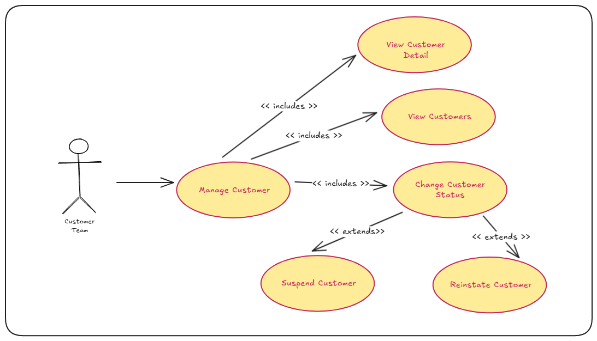
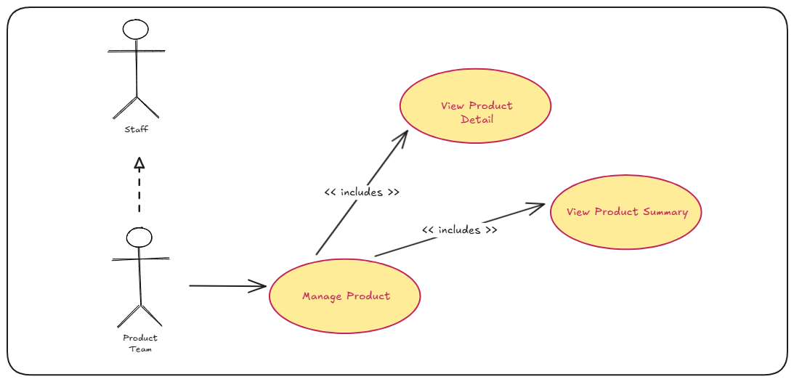
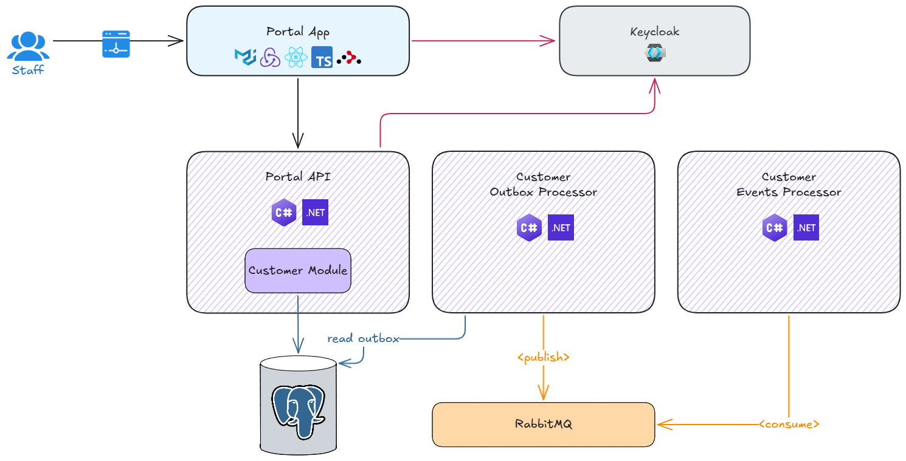

# Offgrid Portal API - Version 1

---

## 🗺️ Overview

As a staff member, you will be able to:

- open the web application with a default landing page
- sign-in, and sign-out

As a Customer Manager, you will be able to:

- manage customer details
  - view list of customers
  - view customer details
  - suspend customer
  - reinstate customer

> [!IMPORTANT]
> &nbsp;  
> Staff user accounts are managed through the Keycloak Admin Portal.  
> &nbsp;  

 

The supported usecases are as follows:

 

- Actor Diagram

  

- Auth Use Case
  
  

- Customer Management Use Cases

  

- Product Management Use Cases
  
  

---

## 📐 High Level Design

---

## 🛒 Portal Website

The scope for this version is as follows:

### Version 1 Scope

- Create initial React application and establish baseline (minimal required setup)
- Introduce User Interface (UI) libraries to provide styling
- Introduce routing libraries to enable navigation
- Introduce state management
- Create navigation bar
- Introduce auth capability like sign-in, and sign-out
- Integrate with Portal API to manage customers
- Create Dockerfile to define Portal web application image

### This Version Scope

- Implement product listing page
- Implement product detail page
- Integrate with Portal API for product data
- Add role-based authorization using Keycloak
- Add mongodb as store for products

---

## { ... } Portal API

The Portal API follows a [modular monolith](https://grok.com/share/c2hhcmQtMw_f1c77275-98eb-4a84-8056-1909c5036e4c) architectural style.

### Version 1 Scope

- Create initial .NET 10 API and establish baseline (minimal requried setup)
- Once a baseline is established, introduce the following capabilities to the API
  - custom logging setup
  - error handling
  - validation
- Create customers endpoint to allow Portal application to manage customer details
  - list customers (with pagination and filters)
  - get customer detail by customer id
  - suspend customer
  - reinstate customer
- Introduce auth capability to ensure that relevant endpoint requests are authorised
- Create Dockerfile to define Portal API image

### This Version Scope

- Create products endpoint to allow Portal application to manage product details
  - list products (with pagination and filters)
  - get product detail by product id
- Integrate with mongodb to store and manage products

---

## 📬 Customer Outbox Processor

The outbox processor reliably publishes customer domain events to the message bus (RabbitMQ) using the outbox pattern. It runs as a background worker that polls the outbox table, converts pending messages into CloudEvents, publishes them to RabbitMQ, and updates outbox state for retries or permanent failure.

### Version 1 Scope

- Create .NET 10 Background service to process customer domain events from the customer outbox table
- Convert domain events into integration events ([CNCF CloudEvents](https://www.cncf.io/projects/cloudevents/))
- Publish integration events to RabbitMQ
- Implement basic retry and failure policies
- Create Dockerfile to define outbox image

---

## ✉️ Customer Event Processor

The event processor consumes customer CloudEvents from RabbitMQ and routes them to handlers. It runs as a set of hosted background services, one per event type, and uses queue-based consumers to process events reliably.

### Version 1 Scope

- Create .NET 10 background service to host background workers
- Create background worker for each integration event type
- Create Dockerfile to define processor image

---

## 🏗️ Infrastructure

### Version 1 Scope

- Define initial Docker compose file to manage API and Web Application services
- Update Keycloak infrastructure with new realm for the Portal admin app
  - Define clients
  - Define roles
  - Define groups
  - Define sample users

### This Version Scope:

- Define RabbitMQ Docker compose service
- Flyway migrations for customer, outbox, and change tracking tables

---
