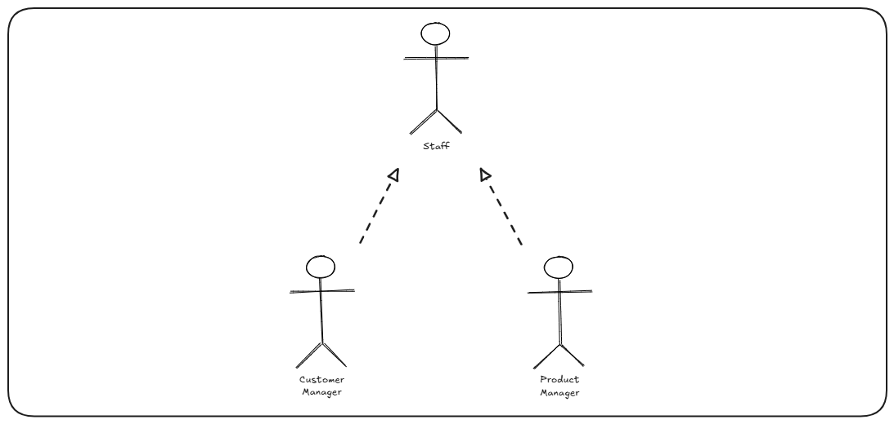
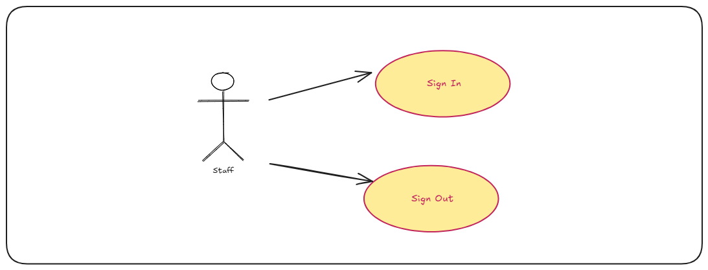
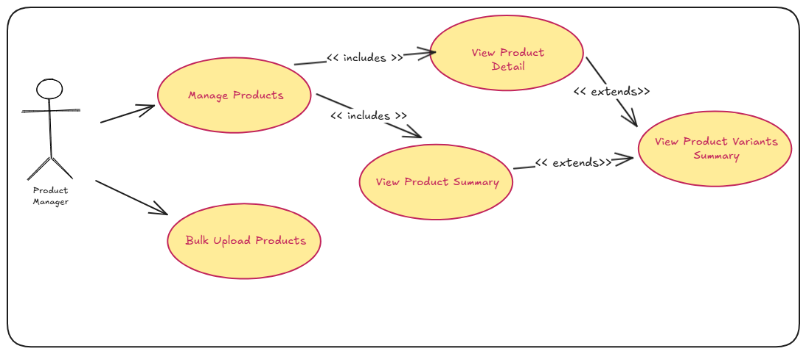
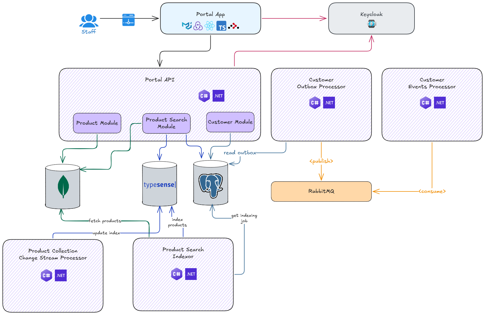

# Offgrid Portal API - Version 1

---

## 🗺️ Overview

As a staff member, you will be able to:

- open the web application with a default landing page
- sign-in, and sign-out

As a Customer Manager, you will be able to:

- manage customer details
  - view list of customers
  - view customer details
  - suspend customer
  - reinstate customer

As a Product Manager, you will be able to:

- view and list products
- bulk upload products

> [!IMPORTANT]
> &nbsp;  
> Staff user accounts are managed through the Keycloak Admin Portal.  
> &nbsp;  

 

The supported usecases are as follows:

 

- Actor Diagram

  

- Auth Use Case
  
  

- Customer Management Use Cases

  

- Product Management Use Cases
  
  

---

## 📐 High Level Design

---

## 🛒 Portal Website

The scope for this version is as follows:

### Version 1 Scope

- Create initial React application and establish baseline (minimal required setup)
- Introduce User Interface (UI) libraries to provide styling
- Introduce routing libraries to enable navigation
- Introduce state management
- Create navigation bar
- Introduce auth capability like sign-in, and sign-out
- Integrate with Portal API to manage customers
- Create Dockerfile to define Portal web application image

### Version 2 Scope

- Implement product listing page
- Implement product detail page
- Integrate with Portal API for product data
- Add role-based authorization using Keycloak
- Add mongodb as store for products

### Version 2.1 Scope

- Implement advanced filtering on product summary page.
- Refactor product page components into smaller components having single responsibility
- Implement role-based access control on pages and menu items

### Version 2.2 Scope

- Implement bulk upload of product catalog
- Index products for product search (mongodb -> typesense)
- Add structured logging

---

## { ... } Portal API

The Portal API follows a [modular monolith](https://grok.com/share/c2hhcmQtMw_f1c77275-98eb-4a84-8056-1909c5036e4c) architectural style.

### Version 1 Scope

- Create initial .NET 10 API and establish baseline (minimal requried setup)
- Once a baseline is established, introduce the following capabilities to the API
  - custom logging setup
  - error handling
  - validation
- Create customers endpoint to allow Portal application to manage customer details
  - list customers (with pagination and filters)
  - get customer detail by customer id
  - suspend customer
  - reinstate customer
- Introduce auth capability to ensure that relevant endpoint requests are authorised
- Create Dockerfile to define Portal API image

### Version 2 Scope

- Create products endpoint to allow Portal application to manage product details
  - list products (with pagination and filters)
  - get product detail by product id
- Integrate with mongodb to store and manage products

### Version 2.1 Scope

- Add advanced filtering to products endpoints
- Add endpoints for product categories, brands, and types

### Version 2.2 Scope

- Add endpoint to bulk upload product catalog to typesense database
- Index products for product search (mongodb -> typesense)

---

## 📬 Customer Outbox Processor

The outbox processor reliably publishes customer domain events to the message bus (RabbitMQ) using the outbox pattern. It runs as a background worker that polls the outbox table, converts pending messages into CloudEvents, publishes them to RabbitMQ, and updates outbox state for retries or permanent failure.

### Version 1 Scope

- Create .NET 10 Background service to process customer domain events from the customer outbox table
- Convert domain events into integration events ([CNCF CloudEvents](https://www.cncf.io/projects/cloudevents/))
- Publish integration events to RabbitMQ
- Implement basic retry and failure policies
- Create Dockerfile to define outbox image

---

## 🔄 Product Search Indexor

### Version 2.2 Scope

Processes the indexing of products for search functionality that will be used by the Shop App. At a high level, it picks up an indexing job from the database, fetches product data from Mongo database, imports (indexes) product search documents into Typesense database.

The Indexor class handles the following responsibilities:

• Integrates with Offgrid.Portal.ProductSearch to maintain searchable product indexes
• Processes product data and prepares it for efficient search operations
• Manages index creation, updates, and maintenance to keep search results current
• Provides indexing operations that enable fast product discovery and filtering
• Ensures product information is properly catalogued and retrievable through the search system

---

## ✉️ Customer Event Processor

The event processor consumes customer CloudEvents from RabbitMQ and routes them to handlers. It runs as a set of hosted background services, one per event type, and uses queue-based consumers to process events reliably.

### Version 1 Scope

- Create .NET 10 background service to host background workers
- Create background worker for each integration event type
- Create Dockerfile to define processor image

---

## 📈 Product Collection Change Feed Processor

A background service can subscribe to MongoDB's product collection change feed using the Change Streams feature. This enables real-time processing of insert, update, and delete operations on the product collection.

### Version 2.2

- Uses MongoDB Change Streams to listen for changes in the product collection.
- Requires a replica set configuration (even for single-node dev setups).
- The background service connects to MongoDB and opens a change stream on the product collection.
- Receives notifications for insert, update, replace, and delete operations.
- Processes each change event (e.g., updating search indexes, triggering downstream workflows).
- Can filter or transform events before further processing.
- Handles reconnection and resume tokens to ensure reliable event consumption.
- Implemented as a long-running .NET background service using MongoDB.Driver's `Watch()` API.
- Supports scalable event-driven architectures for real-time product updates.

---

## 🏗️ Infrastructure

### Version 1

- Define initial Docker compose file to manage API and Web Application services
- Update Keycloak infrastructure with new realm for the Portal admin app
  - Define clients
  - Define roles
  - Define groups
  - Define sample users

### Version 2

- Define RabbitMQ Docker compose service
- Flyway migrations for customer, outbox, and change tracking tables

### Version 2.1

- Define MongoDB Docker compose service
- Implement MongoDB initialization (seed) program

### Version 2.2

- Define Typesense Docker compose service. Typesense is a fast, typo-tolerant, open-source search engine built in C++ and optimized for delivering instant, sub-50ms search-as-you-type experiences with excellent relevance right out of the box.
- Define Seq Docker compose service. Seq from Datalust is a self-hosted, centralized structured logging server designed for collecting, searching, analyzing, and monitoring application logs and traces in real time.

---
