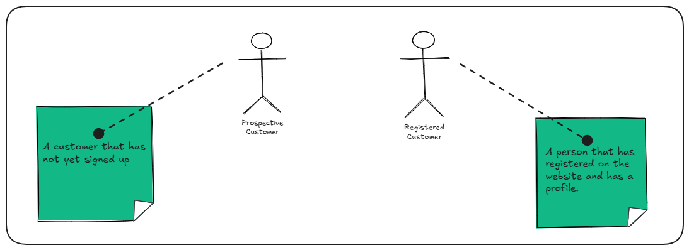
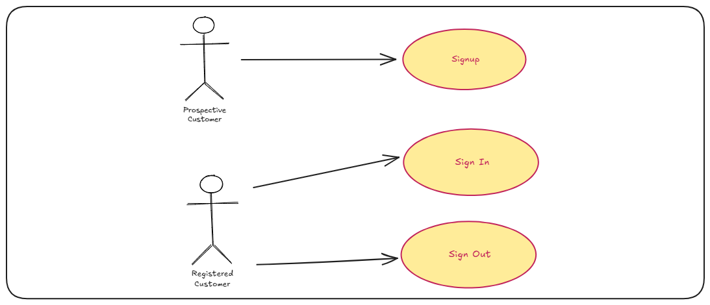
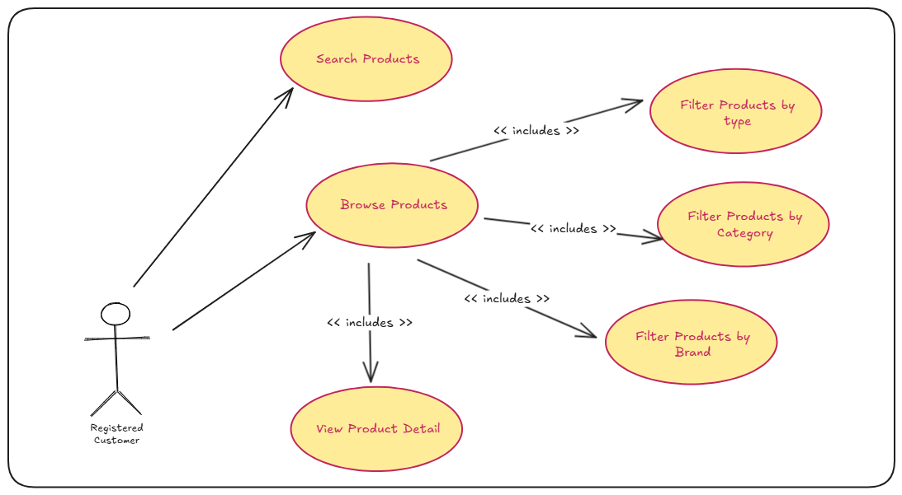
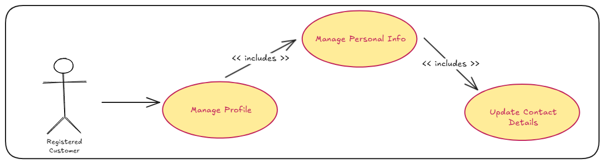
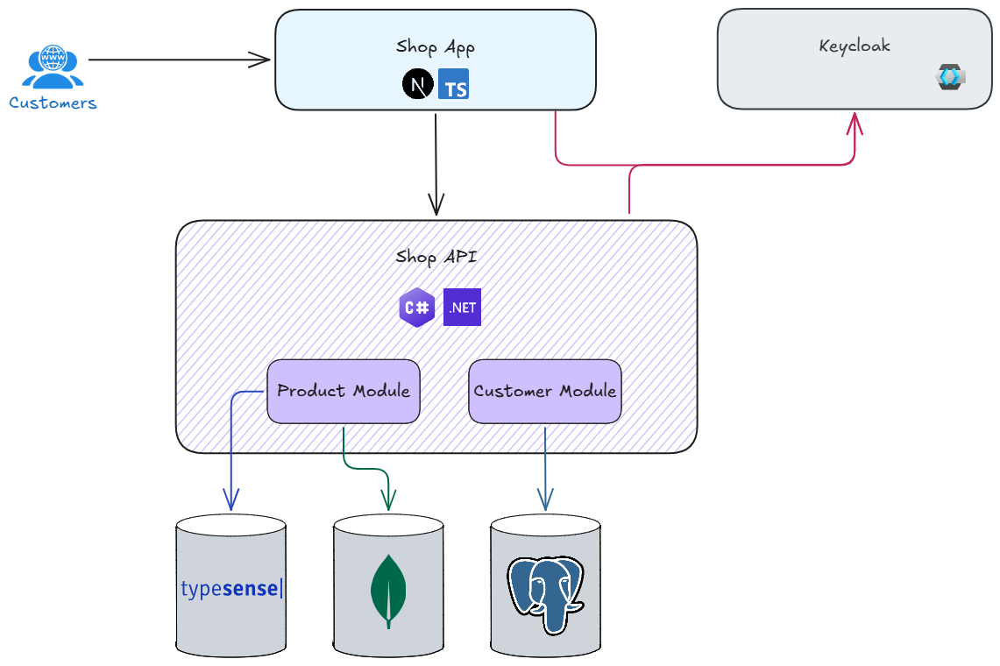

# Offgrid Shop API - Version 1

---

## 🗺️ Overview

As a prospective customer (not yet signed up), you will be able to:

- open the web application with a default landing page
- sign-up

When a prospective customer signs up, an account is created within Identity Provider (Keycloak), and a profile is created via a backend API in the database. The profile in the database is kept in sync with details from Identity Provider.

As a registered customer (sign-up completed), you will be able to:

- open the web application with a default landing page
- sign-in, and sign-out
- view customer details for current account (profile)
- browse products
  - filter products by type
  - filter products by category
  - filter products by brand
  - view product details
- search products

The actors are as follows:

The use cases are as follows:

- Auth:

  

- Product Discovery:

  

- Profile Management

  

---

## 📐 High Level Design

---

## 🛒 Shop Website

### Version 1

- Create initial Next.js application and establish baseline (minimal required setup)
- Introduce User Interface (UI) libraries to provide styling
- Create navigation bar
- Introduce auth capability like sign-up, sign-in, and sign-out
- Integrate with Shop API to create/update customer details
- Create Dockerfile to define Shop web application image

### Version 2

- implement product browsing
  - with filter by type
  - with filter by category
  - with filter by brand
- view product details (including product variants)
- search products

---

## { ... } Shop API

The Shop API follows a [modular monolith](https://grok.com/share/c2hhcmQtMw_f1c77275-98eb-4a84-8056-1909c5036e4c) architectural style.

### Version 1

- Create initial .NET 10 API and establish baseline (minimal requried setup)
- Once a baseline is established, introduce the following capabilities to the API
  - custom logging setup
  - error handling
  - validation
- Create customers endpoint to allow Shop application to create/update customer details
- Introduce auth capability to ensure that relevant endpoint requests are authorised
- Create Dockerfile to define Shop API image

### Version 2.2

- Create products module to list and filter products
- Integrate with MongoDb (for product detail) and typesense (for product browsing and searching)
- Create required API endpoints to fetch product data

---

## 🏗️ Infrastructure

### Version 1

- Define initial Docker compose file to manage required infrastructure services
- Define initial Docker compose file to manage API and Web Application services
- Define Keycloak service
- Define Postgresql service
- Define Redgate Flyway service
- Define Redgate Flyway migrations

---
