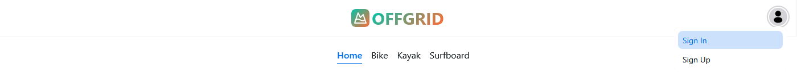
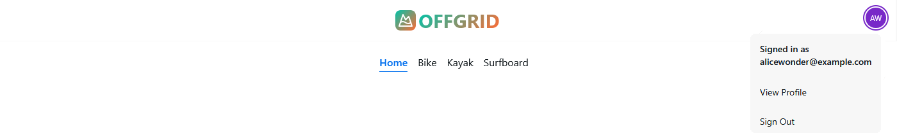
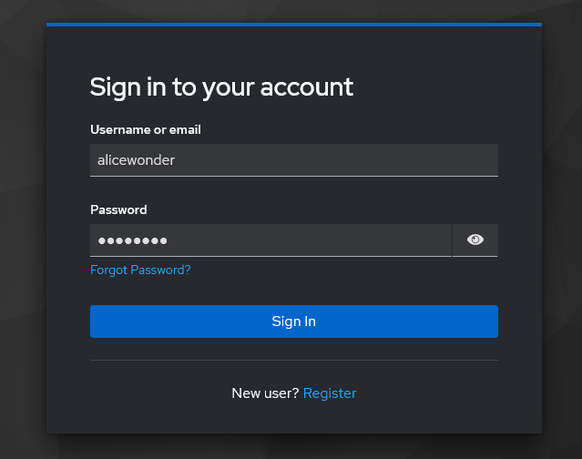
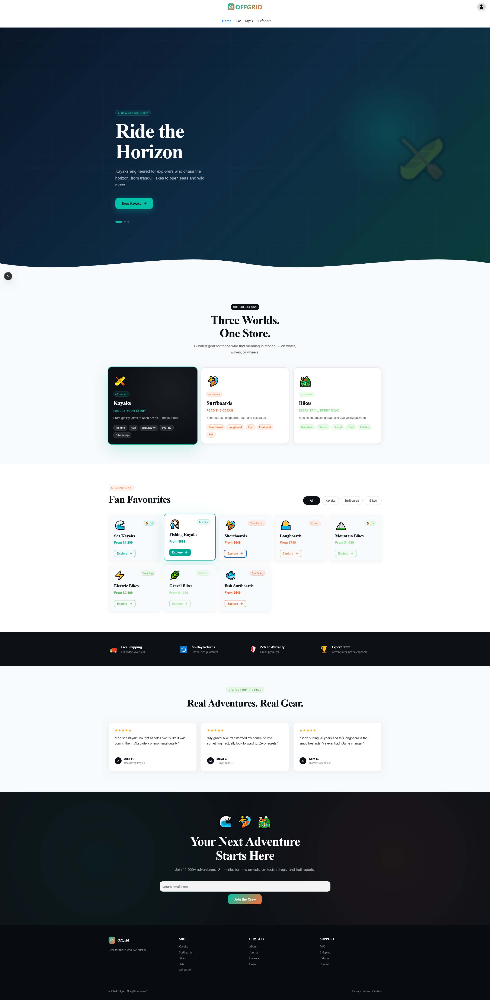
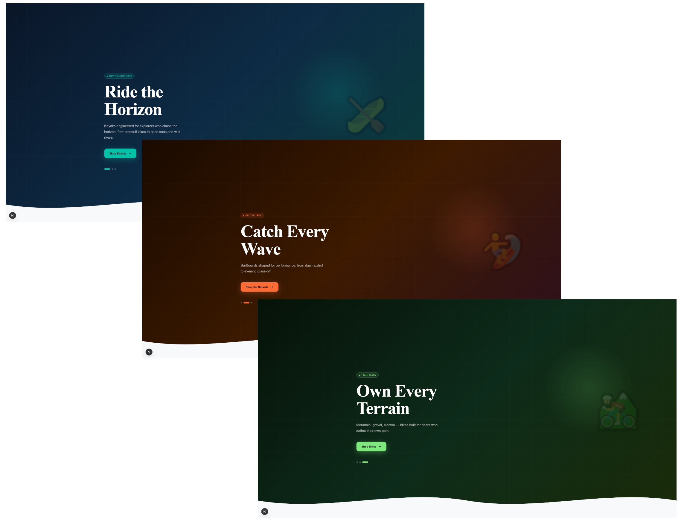
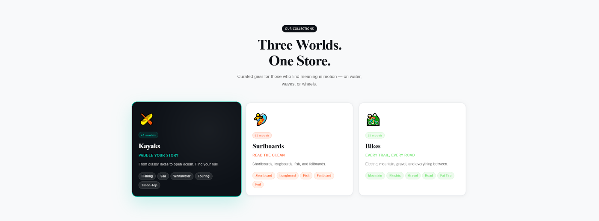
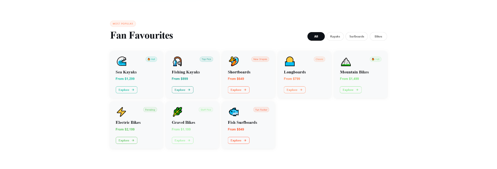
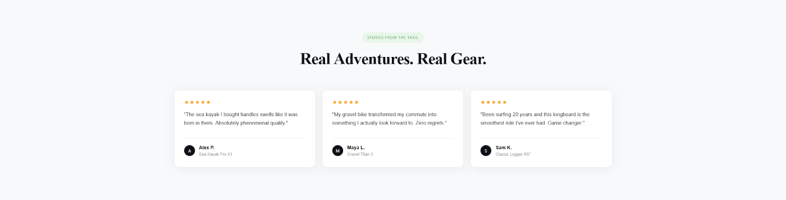

# Offgrid Shop Showcase

## 📱 App Bar (Top Bar)

### 🔹 Not Signed In

### 🔹 Signed In

---

## 📄 Auth Page

Uses default Keycloak auth page to signup/signin.

---

## 📄 Landing Page

### ↔️ Full View

### 🔹 Hero Section

The hero section is the primary visual component showcasing the shop's main value proposition with a prominent call-to-action and background imagery.

Auto-rotating cinematic slides (5s interval) for each product type (Kayaks / Surfboards / Bikes), each with a distinct color palette, a glowing orb background, big decorative emoji, and animated slide-in text. Progress dots let users manually navigate.

### 🔹 Product Types Section

Highlights the primary available types of products.

Three interactive cards (Kayaks, Surfboards, Bikes) that flip to a dark "active" state on click, showing category pills, taglines, and model counts.

### 🔹 Popular Categories Section

Highlights popular product categories.

8 category cards with filter buttons (All / Kayaks / Surfboards / Bikes), hover lift effects, star ratings, review counts, and pricing. Staggered fade-up animations.

### 🔹 Trust Section

Displays key trust signals to shoppers, such as free shipping, easy returns, and secure payment icons. It helps reduce customer uncertainty, lowers bounce rates, and increases conversions by instantly validating the store's legitimacy.

Free shipping, returns, warranty, and expert staff indicators.

### 🔹 Testimonials Section

A high-impact area on a product or home page that displays customer feedback to build trust, reduce purchase hesitation, and increase conversions. 

Three review cards with product attribution.

### 🔹 Call-to-Action Section

Newsletter section.

### 🔹 Footer Section

---
