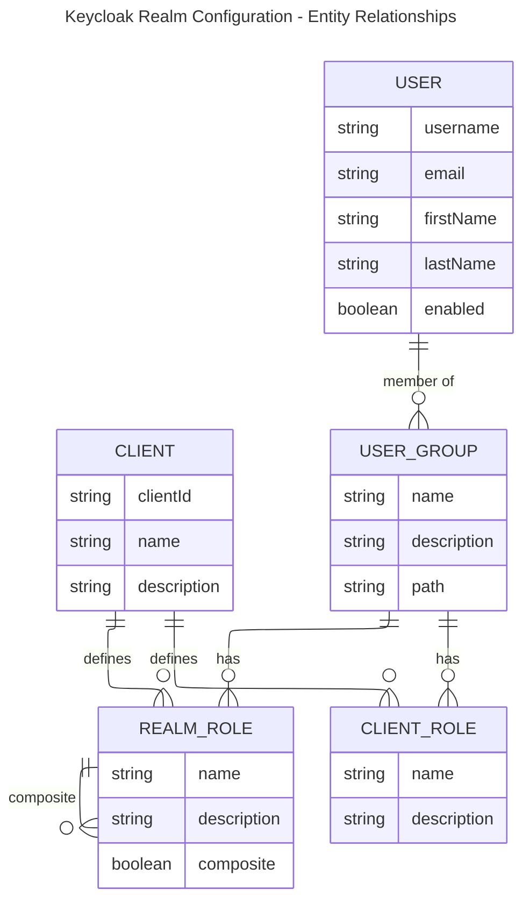

# Local Infrastructure Guide

This folder contains the local infrastructure used for development and testing. It includes Docker Compose files, and helper scripts to bring the stack up/down and to access services.

## Purpose

- Provide a reproducible local environment for services used by the project.

---

## 🤖 Agents Guidance

- Local infra guide: [../agents.md](../agents.md)

---

## 🗂️ Folder Structure

```yaml

infra
│
└── local
    ├── postgres             # postgres service config
    ├── flyway               # flyway service config
    ├── keycloak             # keycloak service config
    ├── mongo                # mongodb service config
    ├── rabbitmq             # rabbitmq service config
    ├── scripts              # collection of bash scripts to manage stack and connect to services
    │    ├── compose.sh      # manage the stack (up, down, exec, ps, logs, recreate)
    │    ├── flyway.sh       # manage the flyway migrations (migrate, info, validate etc)
    │    ├── kcadm.sh        # run keycloak admin cli
    │    ├── mongosh.sh      # run mongo shell and open session to mongo database
    │    ├── psql.sh         # open a psql session for the local Postgres
    │    ├── psql-test.sh    # test postgres connectivity
    │    ├── .env            # local environment settings (must be created based on `.env.example` file)
    │    └── .env.example    # example environment settings that are required to correctly run the local stack
    ├── agents.md            # markdown-based standard acting as a "README for AI agents
    └── compose.yaml         # top-level compose file that coordinates local services.

```

<br />

Postgres:

- [`./postgres/compose.yaml`](./postgres/compose.yaml) — Defines postgres compose service for local development.  

Flyway:

- [`./flyway/compose.yaml`](./flyway/compose.yaml) — Define Flyway compose service to manage Flyway databse migrations.
- [`./flyway/migrations/*.pgsl`](./flyway/migrations) - Migrations folder that contains all database migration definitions

Keycloak:  

- [`./keycloak/compose.yaml`](./keycloak/compose.yaml) — Keycloak compose file and overrides.
- [`./keycloak/realms/offgrid-public-realm.json`](./keycloak/realms/offgrid-public-realm.json) — exported realm configuration for public facing apps, used to initialize Keycloak.
- [`./keycloak/realms/offgrid-internal-realm.json`](./keycloak/realms/offgrid-internal-realm.json) — exported realm configuration for private apps, used to initialize Keycloak.
- [`./keycloak/requests/auth.http`](./keycloak/requests/auth.http) — example HTTP requests demonstrating auth. 

RabbitMQ:

- [./rabbitmq/compose.yaml](./rabbitmq/compose.yaml) - RabbitMQ compose file

MongoDB:

- [./mongo/compose.yaml](./mongo/compose.yaml) - MongoDB compose file that defines mongodb, mongo-express, and mongo-init services
- [./mongo/init-service](./mongo/init-service) - .NET 10 application that is packaged into an image and runs mongo database seeding on initialization
- [./mongo/seed](./mongo/seed) - An alternative seeding method that uses a products.json file and a bash script to seed mongo database

---

## 🚀 Getting Started

> [!IMPORTANT]
> - Run these commands from a Git Bash / POSIX shell (on Windows use Git Bash or WSL).
>
> - Ensure that all scripts have execute (`x`) permissions. Run `chmod +x my-script.sh` to add execute permissions.

- Step 1 - Set environment variables:

  Ensure that a `.env` file is created at the root of the local infrastructure scripts folder (`./infra/local/scripts/.env`). These environment variables are used by the scripts that manage various services.

  See  [`./infra/local/scripts/.env.example`](./scripts/.env.example).

  ```yaml
  # postgres environment variables
  OG_POSTGRES_USER=
  OG_POSTGRES_PASSWORD=
  OG_POSTGRES_DB=

  # postgres pgadmin4 environment variables
  OG_PGADMIN_DEFAULT_EMAIL=
  OG_PGADMIN_DEFAULT_PASSWORD=

  # keycloak environment variables
  OG_KC_BOOTSTRAP_ADMIN_USERNAME=
  OG_KC_BOOTSTRAP_ADMIN_PASSWORD=

  # rabbitmq environment variables
  OG_RABBITMQ_DEFAULT_USER=admin
  OG_RABBITMQ_DEFAULT_PASS=password

  # mongo environment variables
  OG_MONGO_INITDB_ROOT_USERNAME=admin
  OG_MONGO_INITDB_ROOT_PASSWORD=changeme

  # mongo-express environment variables
  OG_ME_CONFIG_MONGODB_ADMINUSERNAME=admin
  OG_ME_CONFIG_MONGODB_ADMINPASSWORD=changeme
  OG_ME_CONFIG_MONGODB_SERVER=mongo
  OG_ME_CONFIG_BASICAUTH_USERNAME=meuser
  OG_ME_CONFIG_BASICAUTH_PASSWORD=changeme
  ```

- Step 2 - Start the stack:

  ```bash

  ./infra/local/scripts/compose.sh up
  
  ```

  Alternatively, run the bundled VS Code tasks (Tasks menu or `Ctrl+Shft+b`) which calls the same script: `bash: compose up`

- Step 3 - Access services:

  - **Keycloak UI:** `http://localhost:8080`
  - **Keycloak Admin CLI (kcadmin):** `./infra/local/scripts/kcadm.sh`
  - **Postgresql CLI (psql):** `./infra/local/scripts/psql.sh`
  - **Rabbitmq Admin CLI (rabbitmqadmin):** `./infra/local/scripts/rabbitmqadmin.sh`
  - **Rabbitmq Management Interface:** `http://localhost:15672`
  - **MongoDB Shell (mongosh):** `./infra/local/scripts/mongosh.sh`

---

## ☰ Common Commands

> [!IMPORTANT]
> - Run these commands from a Git Bash / POSIX shell (on Windows use Git Bash or WSL).
>
> - Ensure that all scripts have execute (`x`) permissions. Run `chmod +x my-script.sh` to add execute permissions.

### Manage Stack

- Start the stack:
  
  ```bash

  ./infra/local/scripts/compose.sh up
  
  ```

  Alternatively, run the bundled VS Code tasks (Tasks menu or `Ctrl+Shft+b`) which calls the same script: `bash: compose up`

- Stop the stack:
  
  ```bash
  
  ./infra/local/scripts/compose.sh down
  
  ```
- Show running services:
  
  ```bash
  
  ./infra/local/scripts/compose.sh ps

  ```
- Show logs for either all services, or specific services:
  
  ```bash

  # show all logs for all services
  ./infra/local/scripts/compose.sh logs

  # show all logs for specific services
  ./infra/local/scripts/compose.sh logs postgres

  ```

### Connect to Services

- Connect to postgres database using `psql`:

  ```bash

  ./infra/local/scripts/psql.sh

  ```

- Test Connection to postgres
  
  ```bash

  ./infra/local/scripts/psql-test.sh

  ```

- Use Flyway CLI:

  ```bash

  ./infra/local/scripts/flyway.sh info

  ```

- Use Keycloak admin CLI:

  ```bash

  ./infra/local/scripts/kcadm.sh

  ```

- Use Rabbitmq admin CLI:

  ```bash

  ./infra/local/scripts/rabbitmqadmin.sh

  ```

- Use Mongo Shell:

  ```bash

  ./infra/local/scripts/mongosh.sh

  ```

---

## 🗝️ About Keycloak Service

[Keycloak](https://www.keycloak.org) is an open-source identity and access management server that provides login, user management, and OAuth2/OpenID Connect authentication for apps and APIs.

See [Keycloak Guide](https://github.com/drminnaar/tech-notes/tree/main/guides/keycloak) for more information on setup.

As part of container initialization, the following `realm` files are imported into keycloak to provide basic realm setup with users, groups, and roles.

- [offgrid-public.json](./keycloak/realms/offgrid-public-realm.json). See [below](#keycloak-realm-configuration-offgrid-public) for more details.

### Access Keycloak

- Access admin UI - [http://localhost:8080](http://localhost:8080)
- Manage Account - [http://localhost:8080/realms/offgrid-public/account](http://localhost:8080/realms/offgrid-public/account)
- OpenId Configuration - [http://localhost:8080/realms/offgrid-public/.well-known/openid-configuration](http://localhost:8080/realms/offgrid-public/.well-known/openid-configuration)

Use Keycloak admin CLI:

```bash
# run script: ./infra/local/scripts/kcadm.sh

bash-5.1$ ./kcadm.sh --help
bash-5.1$ ./kcadm.sh get realms --fields id,realm,enabled

```

### Keycloak Realm Configuration (offgrid-public)

Visually, the keycloak configuration can be viewed as follows:



- Key Relationships:

  - Clients define both Realm Roles and Client Roles
  - Realm Roles can be composite (contain other realm roles) - like customer-gold → customer-silver → customer-standard hierarchy
  - User Groups have assigned Realm Roles and Client Roles
  - Users are members of User Groups

- Specific Structure for Shop app:

- Clients: shop-app (confidential client), shop-api (bearer token only)
- Groups: customer-standard, customer-silver, customer-gold
- Roles: Hierarchical composite roles where customer-gold inherits from customer-silver, which inherits from customer-standard
- Users: johndoe (standard), janedoe (silver), alicewonder (gold)

#### Purpose

Defines a Keycloak realm used by the Next.js shop frontend and the .NET 10 Shop API.

#### Realm Settings

- Registration enabled  
- Email login allowed  
- Password reset allowed  
- Default group: `/customer-standard`

#### Roles

##### Realm Roles (Customer Tiers)

- `customer-standard` (base tier)  
- `customer-silver` (composite: includes standard)  
- `customer-gold` (composite: includes silver)

##### Client Roles

- `shop-api` → `api-access` (API access gate)

#### Groups

- `customer-standard`, `customer-silver`, `customer-gold`  
  - Each group assigns the corresponding realm role  
  - Each group also grants `shop-api` → `api-access`  
  - Descriptions clarify tier benefits

#### Clients

##### shop-app

- Public client for browser logins  
- Audience mapper adds `shop-api` to `aud` in tokens

##### shop-api

- Bearer-only client used for API token validation

#### Seed Users

- `johndoe` → `/customer-standard`  
- `janedoe` → `/customer-silver`  
- `alicewonder` → `/customer-gold`

#### Token Behavior

- Customer tiers appear in `realm_access.roles`  
- API should validate `aud = shop-api` and authorize via realm roles

---

## 📝 Notes & Recommendations

- On Windows, prefer running scripts with Git Bash or WSL to avoid shell incompatibilities.

- If ports conflict, inspect compose.yaml and service-specific compose files for port mappings.

- For debugging, inspect logs with:
  - `compose.sh logs` or `compose.sh logs <<service_name>>`
  - open DB shells with `psql.sh`

---
