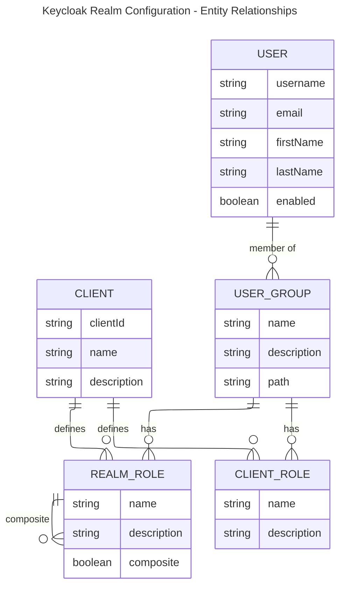

# Keycloak Realm Configuration (offgrid-public)

Defines a Keycloak realm used by the Next.js shop frontend and the .NET 10 Shop API.

Visually, the keycloak configuration can be viewed as follows:

- Key Relationships:

  - Clients define both Realm Roles and Client Roles
  - Realm Roles can be composite (contain other realm roles) - like customer-gold → customer-silver → customer-standard hierarchy
  - User Groups have assigned Realm Roles and Client Roles
  - Users are members of User Groups

- Specific Structure for Shop app:

- Clients: shop-app (confidential client), shop-api (bearer token only)
- Groups: customer-standard, customer-silver, customer-gold
- Roles: Hierarchical composite roles where customer-gold inherits from customer-silver, which inherits from customer-standard
- Users: johndoe (standard), janedoe (silver), alicewonder (gold)

---

## Realm Settings

- Registration enabled  
- Email login allowed  
- Password reset allowed  
- Default group: `/customer-standard`

---

## Roles

### Realm Roles (Customer Tiers)

- `customer-standard` (base tier)  
- `customer-silver` (composite: includes standard)  
- `customer-gold` (composite: includes silver)

### Client Roles

- `shop-api` → `api-access` (API access gate)

---

## Groups

- `customer-standard`, `customer-silver`, `customer-gold`  
  - Each group assigns the corresponding realm role  
  - Each group also grants `shop-api` → `api-access`  
  - Descriptions clarify tier benefits

---

## Clients

### shop-app

- Public client for browser logins  
- Audience mapper adds `shop-api` to `aud` in tokens

### shop-api

- Bearer-only client used for API token validation

---

## Seed Users

- `johndoe` → `/customer-standard`  
- `janedoe` → `/customer-silver`  
- `alicewonder` → `/customer-gold`

---

## Token Behavior

- Customer tiers appear in `realm_access.roles`  
- API should validate `aud = shop-api` and authorize via realm roles

---
