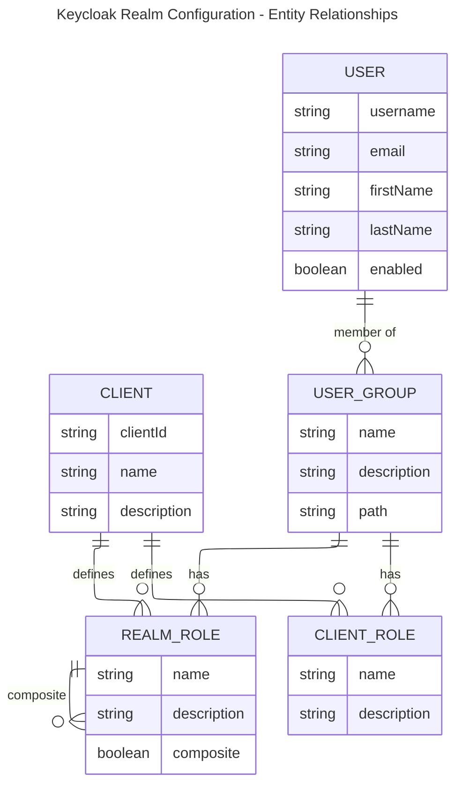

# Offgrid Internal Keycloak Realm Configuration

This configuration sets up authentication and authorization for the Offgrid admin portal.

Visually, the keycloak configuration can be viewed as follows:

## Realm Settings

- **Name:** `offgrid-internal`
- **Enabled:** Yes
- **User Registration:** Disabled
- **Login with Email:** Enabled
- **Password Reset:** Enabled
- **Brute Force Protection:** Disabled

---

## Roles

### Realm Roles
- **admin:** Full administrative access
- **customer-manager:** Manage customer accounts and profiles
- **product-manager:** Manage products, inventory, and catalog

### Client Roles (`portal-api`)
- **api-access:** Allows access to the .NET 10 backend

---

## Groups

- **administrators:**  
  System administrators with all main roles and API access
- **product-team:**  
  Product managers with product-manager role and API access
- **customer-team:**  
  Customer managers with customer-manager role and API access

---

## Clients

- **portal-app:**  
  - React admin frontend  
  - Public client, OpenID Connect, PKCE enabled  
  - Standard flow, direct access grants enabled  
  - Audience and role claims mapped for API access

- **portal-api:**  
  - .NET backend API  
  - Bearer-only client, OpenID Connect

---

## Protocol Mappers

- **portal-api-audience:** Adds `portal-api` as audience in tokens
- **realmroles-to-role-claim:** Maps realm roles to the `role` claim in tokens

---

## Users

- **portal-admin:** Admin user, member of administrators group
- **product-manager:** Product manager, member of product-team group
- **customer-manager:** Customer manager, member of customer-team group

All users have default password: `password`

---
