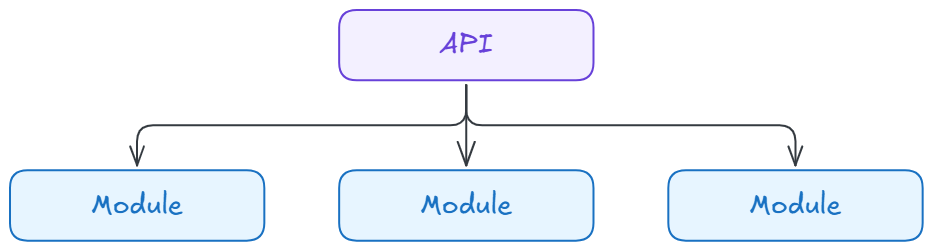

# Portal API

This is the primary API used by the Portal admin app.

---

## 🤖 Agents Guidance

- Local guide: [./agents.md](./agents.md)

---

## 📐 Design

### High Level Solution Design

See [design documentation](../../docs/portal/design/):

- [Version 1 - README](../../docs/portal/design/version-1/README.md) - Represents `version 1` target state.
- [Version 2 - README](../../docs/portal/design/version-2/README.md) - Represents `version 2` target state.
- [Version 2.1 - README (Current)](../../docs/portal/design/version-2_1/README.md) - Represents `version 2.1` target state.

### High Level API Design

The overall API design follows a layered architecture using a [Modular Monolith](https://www.thoughtworks.com/en-us/insights/blog/microservices/modular-monolith-better-way-build-software) design. Each module uses a layered architecture similar to the [Clean Architecture](https://grokipedia.com/page/Clean_Architecture).

The following diagram illustrates that an API will use one or more modules to satisfy the the API resource requirements:

<br />



<br />

The following diagram illustrates the various layers of the architecture, along with the direction of dependencies:

<br />


<br />

---

## 📚 Project Description

### ✨ Portal API

#### Responsibilities

- Expose customer and product management endpoints for the Portal web app.
- Enforce authentication and authorization for staff and Customer Team actions.
- Persist customer changes and emit domain events to the outbox.

#### Core Capabilities

**Customer Endpoints:**
- View customer by ID
- List all customers
- Suspend customer
- Reinstate customer
- (Planned) Group assignment

**Product Endpoints:**
- List all products
- Get product by ID
- Get product variants

**General:**
- Validation and error handling with consistent API responses
- Structured logging to support operational diagnostics

#### Integration Points

- Keycloak Admin API for staff account and user attribute management.
- PostgreSQL for the customer domain and outbox storage.
- RabbitMQ via the outbox processor for downstream event distribution.

#### Domain Event Flow

- API commands write customer changes in the same transaction as outbox messages.
- Outbox messages are later published as CloudEvents by the outbox processor.
- Event processor workers consume those CloudEvents for downstream handling.

### ✨ Customer Outbox

The outbox processor reliably publishes customer domain events to the message bus using the outbox pattern. It runs as a background worker that polls the outbox table, converts pending messages into CloudEvents, publishes them to RabbitMQ, and updates outbox state for retries or permanent failure.

#### Responsibilities

- Poll the outbox table (`customers.customer_outbox_message`) for pending records
- Publish each message as a CloudEvent to the message bus
- Mark messages as processed, failed (with a retry schedule), or dead lettered
- Modular command and event handler structure for extensibility

#### Processing Loop

- `CustomerOutboxWorker` runs continuously as a hosted background service.
- Every 10 seconds it requests a batch of pending messages (current batch size is 1).
- `CustomerOutboxService` processes each message and commits state changes in a single unit of work.

#### Retry and Failure Policy

- A message is pending if it is not dead lettered, has no `processed_at`, and `next_retry_at` is null or in the past.
- On publish failure, the message is marked failed, `retry_count` is incremented, and `next_retry_at` is set using exponential backoff.
- Exponential backoff uses $30 \times 2^{retry\_count}$ seconds.
- After 5 retries the message is marked as dead lettered (`is_deadletter = true`).
- If the publish succeeds but the commit fails, the message can be re-published; consumers must be idempotent.

#### CloudEvent Mapping

The outbox processor emits CloudEvents using the following mapping:

- `CustomerChangedEvent` -> `com.offgrid.portal.customers.customer-changed`
- `CustomerReinstatedEvent` -> `com.offgrid.portal.customers.customer-reinstated`
- `CustomerSuspendedEvent` -> `com.offgrid.portal.customers.customer-suspended`

Each event sets:

- `source`: `urn:offgrid:customers:outboxworker`
- `subject`: `customers/{aggregateId}`
- `correlationid`: copied from the domain event

#### Observability

- Successful publish attempts are logged with CloudEvent id and type.
- Failures log the exception and include retry scheduling details.
- The outbox table can be inspected directly for troubleshooting and replay decisions.

### ✨ Customer Event Processor

The event processor consumes customer CloudEvents from RabbitMQ and routes them to handlers. It runs as a set of hosted background services, one per event type, and uses queue-based consumers to process events reliably.

#### Responsibilities

- Connect to RabbitMQ using configured client settings
- Consume CloudEvents from dedicated queues
- Dispatch each event to a registered handler
- Modular event worker classes for each event type

#### Processing Model

Each event type has its own worker:
  - `CustomerChangedEventWorker`
  - `CustomerSuspendedEventWorker`
  - `CustomerReinstatedEventWorker`
Each worker runs a `RabbitMqCloudEventConsumer<TEvent>` and blocks on `ConsumeAsync` until shutdown.
Event contracts are defined for each domain event type, supporting extensible payloads and metadata.

#### Queue and Routing Keys

- Queue: `offgrid.portal.customers.customer-changed` -> routing key `com.offgrid.portal.customers.customer-changed`
- Queue: `offgrid.portal.customers.customer-suspended` -> routing key `com.offgrid.portal.customers.customer-suspended`
- Queue: `offgrid.portal.customers.customer-reinstated` -> routing key `com.offgrid.portal.customers.customer-reinstated`

#### Handlers

- Current handlers are console-focused for local development visibility.
- Each handler logs event metadata and renders a formatted payload view.
- Additional production behaviors (e.g., indexing, downstream notifications) can be added in the handler implementations.

---

## 🚀 Getting Started

### 1. Run Infra Services

Ensure that you have followed the project infrastructure [README](../../infra/local/README.md) guide and have the required services running on your local machine.

The following requirements must be satisfied before running Portal API:

- ✅️ Postgresql service is running
- ✅️ Keycloak service is running
- ✅️ RabbitMQ service is running
- ✅️ MongoDB service is running
- ✅️ Flyway migrations applied

### 2. Start API

```bash
# ./services/portal

dotnet watch run --project ./src/Offgrid.Portal.Api

```

### 3. Run API Requests

The [REST Client](https://marketplace.visualstudio.com/items?itemName=humao.rest-client) VSCode extension is required to run requests.

**Customer Endpoints:**

- Get customer by ID: [`customers-getbyid.http`](./requests/customers-getbyid.http)
- Get all customers: [`customers-getall.http`](./requests/customers-getall.http)
- Suspend customer: [`customers-suspend.http`](./requests/customers-suspend.http)
- Reinstate customer: [`customers-reinstate.http`](./requests/customers-reinstate.http)

**Product Endpoints:**

- Get all products: [`products-getall.http`](./requests/products-getall.http)
- Get product details by product id: [`products-getbyid.http`](./requests/products-getbyid.http)
- Get product variants by product id: [`products-getvariants.http`](./requests/products-getvariants.http)

**Root Endpoint:**

- See API metadata: [`root.http`](./requests/root.http)

### 4. Run Outbox Processor

### Start Processor

```bash
# ./services/portal

dotnet watch run --project ./src/Offgrid.Portal.Customers.OutboxProcessor

```

### View Outbox table

```bash
# ../../infra/local/scripts/

./psql.sh

```

```sql
SELECT
  id
  ,event_type_id
  ,event_type
  ,created_at
  ,occurred_at
  ,processed_at
  ,retry_count
  ,next_retry_at
  ,is_deadletter
FROM customers.customer_outbox_message;
```

---
